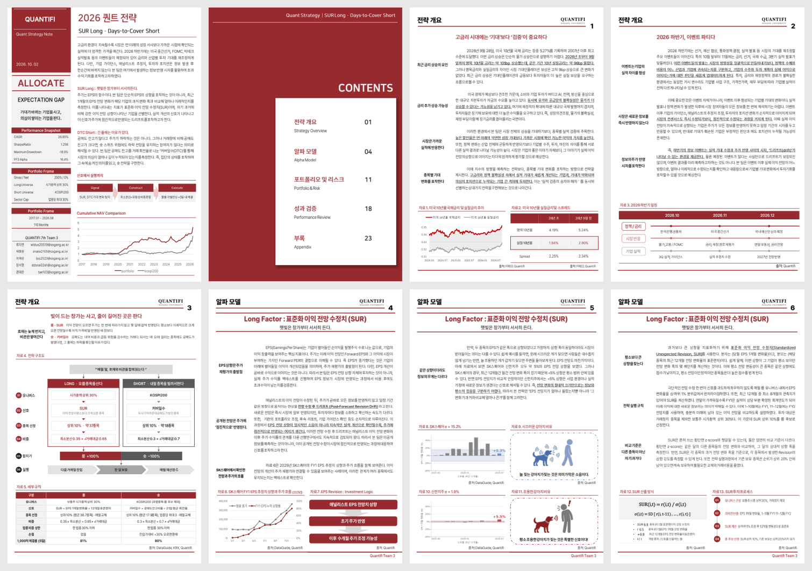
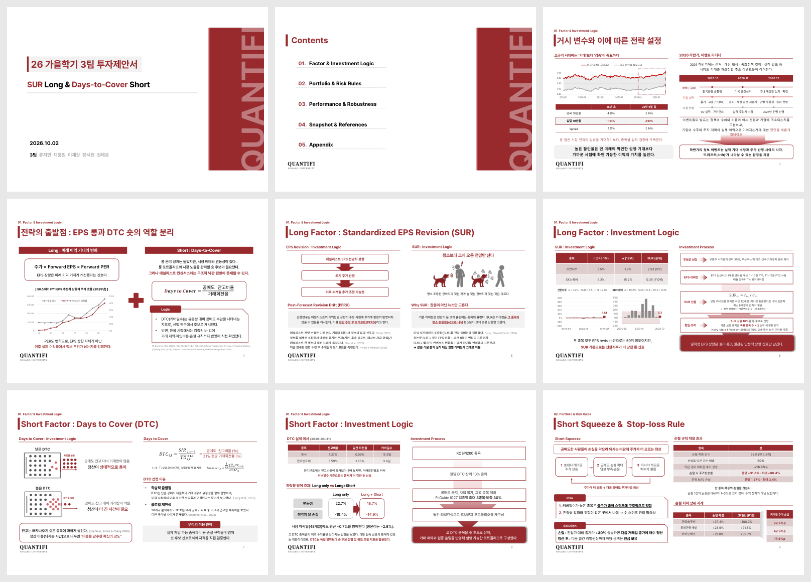
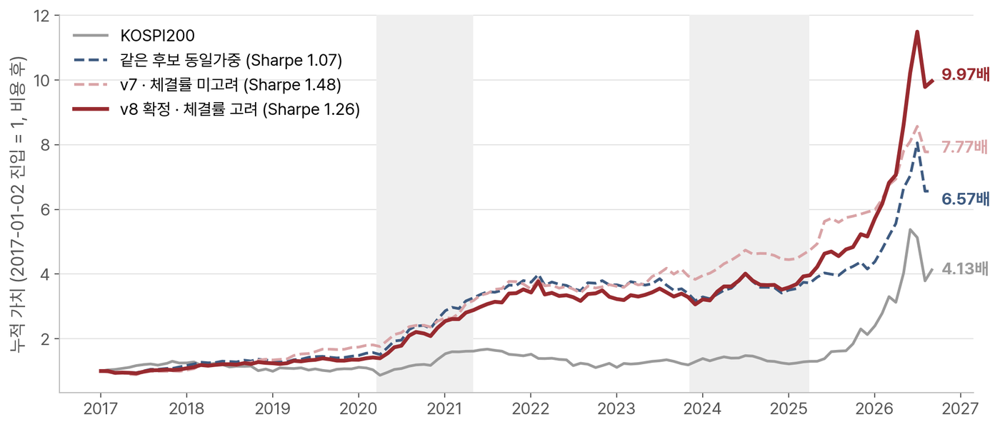
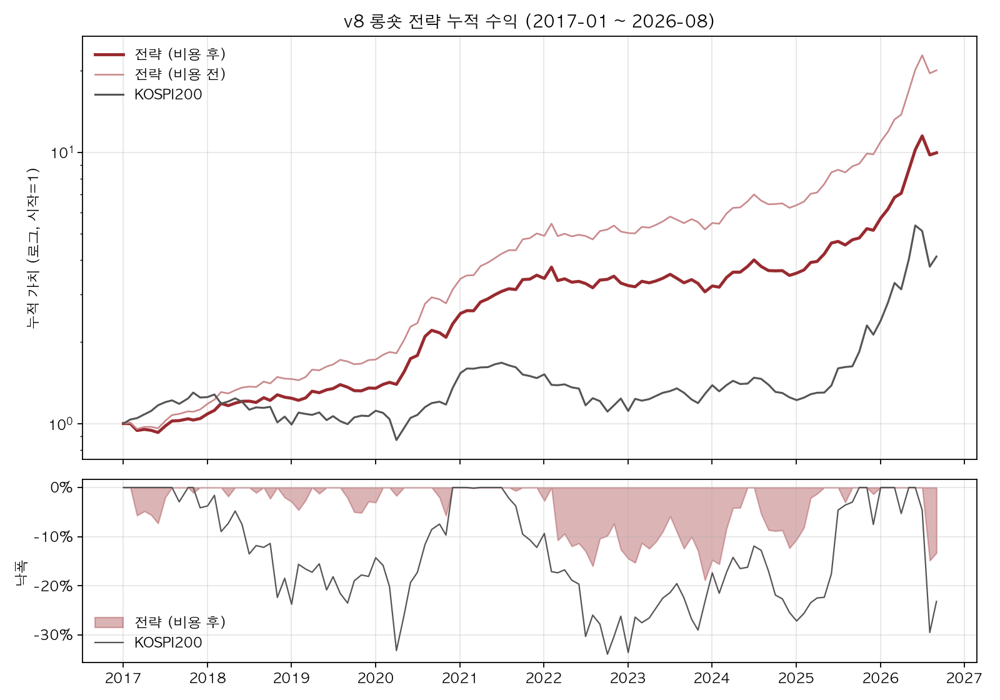
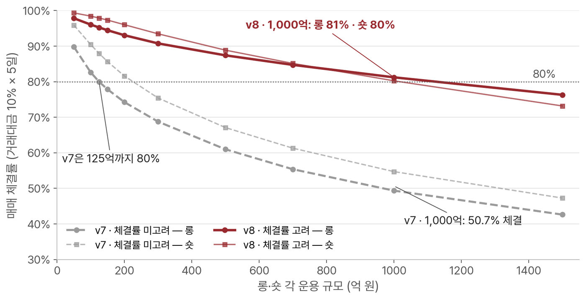
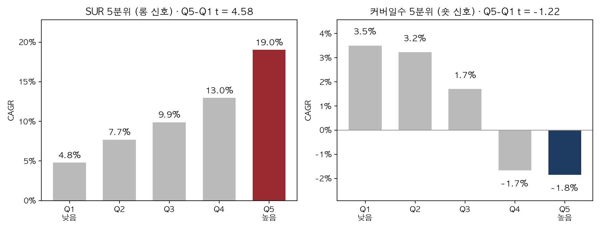
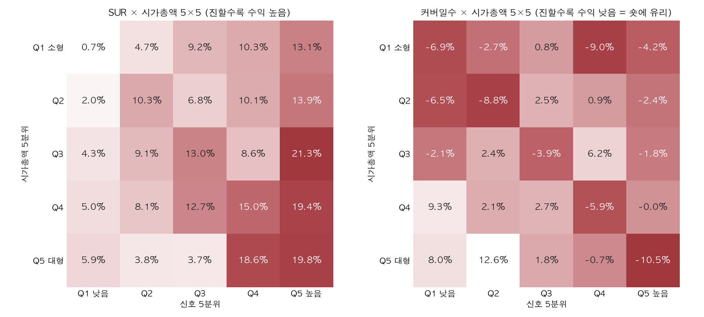
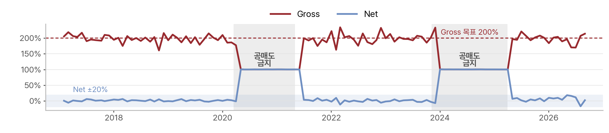
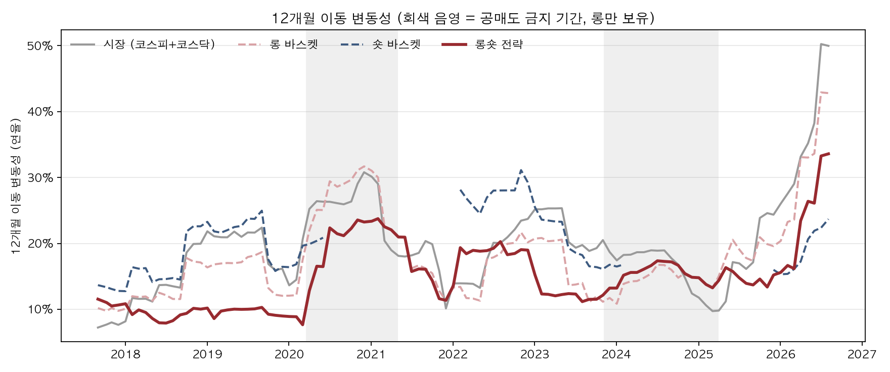

# SUR Long · Days-to-Cover Short — Korean Equity Long/Short Strategy

> **QUANTIFI (Sogang University quant investment society), Team 3 · 2026 Fall**
> Ryu Jiyeon (류지연), Chae Jongwon (채종원), Lee Jaesang (이재상), Jang Seohyun (장서현), Kwon Taeeun (권태은)

**[Strategy Report (PDF)](docs/presentation/QUANTIFI_Team3_Strategy_Report.pdf)** · **[투자제안서 · Final Presentation (PDF)](docs/presentation/QUANTIFI_Team3_Final_Presentation.pdf)** · **[Backtest Notebook](notebooks/v8_backtest.ipynb)** · **[전략 설명서](docs/strategy_v8.md)**

<table>
<tr>
<td width="50%" align="center"><b>Strategy Report</b> (26p)<br><a href="docs/presentation/QUANTIFI_Team3_Strategy_Report.pdf"></a></td>
<td width="50%" align="center"><b>투자제안서 · Final Presentation</b> (33p)<br><a href="docs/presentation/QUANTIFI_Team3_Final_Presentation.pdf"></a></td>
</tr>
</table>

<sub>이미지를 누르면 PDF가 열립니다 · Click a preview to open the PDF.</sub>

## English summary

A monthly-rebalanced, dollar-neutral long/short strategy on Korean equities (KOSPI·KOSDAQ).

- **Long:** stocks whose analyst EPS forecast revision is unusually large *relative to that stock's own revision history*.
  - Signal: **SUR**, standardized revision. It is the 1-month EPS revision divided by the stock's 12-month revision volatility.
  - Universe: top 30% of common stocks by market cap.
- **Short:** KOSPI200 stocks with the heaviest short interest *relative to trading activity*.
  - Signal: **days-to-cover**, short-interest ratio ÷ 21-day turnover.
  - Rules: max 3 names per industry, +30% stop-loss.
- **Weights:** a blend of Ledoit-Wolf minimum-variance and √(average daily value traded).
  - The blend is set so that ≥80% of each month's trades fill at 100bn KRW per leg, trading 10% of daily volume over 5 days.
  - Each industry is capped at 30% per leg.
- **Exposure:** 100% long / 100% short (gross 200%, net 0%). The book holds long-only during Korea's short-selling bans.

| Backtest (Jan 2017 – Aug 2026, 116 months, after costs) | Strategy | KOSPI200 |
|---|---:|---:|
| CAGR | 26.9% | 15.8% |
| Sharpe (excess over CD91) | 1.26 | 0.59 |
| Annual volatility | 18.7% | 27.5% |
| Max drawdown | −18.9% | −33.9% |
| FF3 alpha, KOSPI+KOSDAQ cap-weighted market (t-stat) | 16.4% (3.13) | — |

**Assumptions**
- Costs: 50bp round-trip trading cost and 3% annual borrow fee.
- Short-sale proceeds earn the CD91 rate.
- Returns include cash dividends.
- Results are from a historical backtest, not live trading.

**Run:** `pip install -r requirements.txt`, place the processed data in `data/processed/` (see `data/README.md`), then run `notebooks/v8_backtest.ipynb`. The market data comes from a licensed vendor (FnGuide DataGuide) and is **not included** in this repository.

## Results

**Cumulative return** — v8 (liquidity-aware, final) vs v7 (min-variance only) vs equal weight vs KOSPI200


**Cumulative return and drawdown (v8, after costs)**


**Capacity** — share of monthly trades filled at 10% of daily value traded over 5 days, by AUM per leg


**Signal quintiles** — next-month CAGR by SUR quintile (long signal) and days-to-cover quintile (short signal)


**Signal × size (5×5)** — the SUR spread holds in every size bucket; the days-to-cover effect is strongest in large caps


**Exposure** — gross 200% / net 0% when shorting is allowed, long-only during short-selling bans (shaded)


**12-month rolling volatility** — long basket, short basket, long/short strategy, market


---

## 전략 요약

| 구분 | 규칙 |
|---|---|
| 롱 | 보통주 시가총액 상위 30% 중 **SUR 상위 10%** (월 약 37종목) |
| 숏 | KOSPI200(과열종목 제외) 중 **커버일수 상위 10%** (월 약 18종목), 한 업종 최대 3종목 |
| 비중 | (1 − a) × 최소분산(252일 Ledoit-Wolf 상관 × 지수가중 변동성) + a × √거래대금, a = 롱 0.65 · 숏 0.7. 롱·숏 각각 한 업종 비중 ≤ 30% |
| 노출 | 롱 100% · 숏 100% (gross 200%, net 0%). 공매도 금지 기간에는 롱 100%만 |
| 리스크 | 숏 종목이 진입가 대비 +30%면 다음 거래일 종가에 환매 |
| 체결 | 매월 마지막 거래일 신호 → 다음 거래일 종가 진입·청산 |
| 비용 | 왕복 50bp, 대차 연 3%, 숏 매도대금 CD91 이자 수령 |

**SUR (Standardized Unexpected Revision)**
EPS 1개월 리비전을 그 종목의 과거 12개월 리비전 표준편차로 나눈 값입니다. 평소 전망이 잘 바뀌지 않던 종목의 상향은 같은 크기라도 더 강한 신호로 봅니다. 회계 문헌의 SUE(예상 밖 이익 ÷ 과거 변동성)를 애널리스트 전망 리비전에 적용한 것입니다.

**커버일수 (Days to Cover)**
공매도 잔고를 하루 평균 거래량으로 되사는 데 걸리는 일수입니다. 잔고 자체보다, 거래량에 비해 무겁게 쌓인 공매도를 공매도 투자자의 확신으로 해석합니다.

**체결률을 고려한 비중**
최소분산만 쓰면 Sharpe가 1.48로 더 높습니다. 하지만 거래가 적은 종목에 비중이 몰려, 롱·숏 각 1,000억에서는 주문의 약 50%만 체결됩니다. 이 경우 운용 가능 규모는 약 125억입니다. 그래서 √거래대금 비중을 섞어 1,000억에서도 체결률 80% 이상을 지키는 설정을 최종안으로 정했습니다.

## 저장소 구조

```
├── README.md
├── requirements.txt
├── docs/
│   ├── strategy_v8.md            전략 설명서 (신호 논리, 규칙, 성과, 검증, 한계)
│   ├── figures/                  설명서 그림
│   └── presentation/             최종 발표자료, 전략 리포트 (PDF)
├── code/
│   ├── strategy_v8.py            백테스트 엔진 (규칙은 파일 맨 위 PARAMS)
│   ├── build_processed_data.py   원천 엑셀 → 가공 데이터 변환
│   └── research_results/         앵커 검증에 쓰는 연구 단계 설정들의 월별 수익률
├── notebooks/
│   └── v8_backtest.ipynb         실행 노트북 (출력 포함)
├── output/                       노트북 실행 결과 (csv, 그림)
└── data/
    └── README.md                 필요한 데이터 목록과 형식 (데이터 자체는 미포함)
```

## 노트북에서 볼 수 있는 것

| 절 | 내용 |
|---|---|
| 4-2 | 신호 검증: SUR·커버일수 5분위, 시가총액 교차 히트맵 (3×3·4×4·5×5) |
| 5~8 | 백테스트, 성과 요약, 연도별 수익률, 누적 수익·낙폭 |
| 9 | 구간별 Sharpe (S1·S2·S3) |
| 10 | 요인 회귀 (CAPM·FF3, KOSPI200 / 코스피+코스닥 시총가중 시장) |
| 11 | 비용·회전율·손절 |
| 12 | 운용 규모별 체결률, 체결률을 고려하지 않은 비중(v7)과 비교 |
| 13 | 최근 보유 종목 |
| 14 | 변동성 분해, 롱온리 비교 |
| 15 | 설정값 민감도 (44개), 혼합 비율 민감도 (11개) |
| 16 | 앵커 워크포워드 검증 (66개 설정) |

## 실행 방법

```bash
pip install -r requirements.txt
# data/processed/ 에 가공 데이터를 둔다 (data/README.md 참고)
cd notebooks
jupyter notebook v8_backtest.ipynb      # 위에서부터 실행 (약 1분 30초)
```

원천 엑셀이 있으면 `python code/build_processed_data.py`로 가공 데이터를 만들 수 있습니다(약 6분).

## 한계

- **표본:** 공매도 잔고 데이터가 2016년 6월부터라 숏 신호는 2016-12 이후만 백테스트할 수 있습니다(116개월).
- **설정 선택:** SUR 창, 종목 비율 같은 설정은 이 기간 결과를 함께 보고 정했습니다. 앞 기간으로만 골랐을 때의 결과는 노트북 16절(앵커 검증)에 있습니다.
- **벤치마크:** KOSPI200은 가격지수(배당 미포함)입니다. 배당 포함 시장과의 비교는 노트북 10절에 있습니다.
- **가정:** 숏 매도대금 이자(CD91)를 받는다고 가정했고, 받지 못하면 Sharpe는 1.17입니다.
- **백테스트:** 실제 운용 결과가 아니며, 거래 비용과 체결은 가정에 따른 추정입니다.

## 데이터

FnGuide DataGuide(가격·시가총액·거래대금·공매도 잔고·EPS 컨센서스·업종), KRX(공매도 과열종목, KOSPI200 구성종목), 한국은행 CD91, 네이버증권 업종(FnGuide 업종 결측 보완)을 썼습니다. DataGuide 데이터는 이용 약관상 재배포할 수 없어 저장소에 포함하지 않았습니다.
