# 확정 설계 최종 (v8) — 체결률 고려: SUR 롱 · 커버일수 숏 · 최소분산 + √거래대금 혼합 · 롱·숏 업종 비중 30%

확정 2026-09-29 · 포지션 회계 수정 2026-09-30 · 3팀 (류지연 채종원 이재상 장서현 권태은)
재현: `notebooks/v8_backtest.ipynb` (엔진 `code/strategy_v8.py`, 데이터 `data/processed/`) · 그림 `docs/figures/`

> **백테스트 기간: 2017-01-02 진입 ~ 2026-09-01 청산 (116개월, 보유 2017년 1월 ~ 2026년 8월)**
> 신호월 2016-12 ~ 2026-07. 수익률·MDD·NAV는 **총수익 기준**(현금배당 포함 수정주가). Sharpe와 요인 회귀 알파만 CD91 차감. **숏 매도대금은 CD91 이자를 받는다고 가정**(숏 운용월, 연 +1.6%).

> **v7 → v8에서 바뀐 것: 체결률을 고려한 비중.** 롱·숏 각 1,000억을 운용할 때 **매매 체결률(21일 평균 거래대금 × 10% × 5일) 80% 이상**이 되도록, 비중 = (1 − a) × 최소분산 + a × √거래대금 비례, **a = 롱 0.65 · 숏 0.7**(각 다리가 80%를 넘는 가장 작은 값). 종목 선정·노출·업종 상한·손절은 v7과 같다.
> - v8: Sharpe **1.26**, 1,000억 체결률 **81% / 80%** (롱 / 숏)
> - v7 (체결률 미고려): Sharpe 1.48, 1,000억 체결률 49% / 55% — **운용 가능 규모 약 125억** (8-6절)
>
> **포지션 회계 수정 (2026-09-30, 코드 검토 반영).** 성과 수치는 모두 수정 후 값이다.
> - ① 회전율(거래비용)을 **목표 비중끼리가 아니라 한 달 수익률로 떠내려간 실제 보유**와 비교한다.
> - ② 손절한 숏은 **청산 매수 1회**로 세고 다음 달은 **보유 0에서 출발**한다. 이전에는 청산·재진입 2회로 셌고, 다음 달에는 아직 보유 중인 것으로 봤다.
> - ③ 손절 종목의 **대차비용·매도대금 이자는 실제 보유 거래일만큼**만 반영한다.
> - ④ 최소분산 계산에 분산 0·특이행렬 방어를 넣었다. 결과는 변하지 않는다.
> - **영향:** v8 Sharpe 1.254 → **1.256**, 연 회전율 20.9 → 20.7회. v7은 1.476 → 1.478.
> - 검토에서 확인을 요청한 두 항목은 수정할 것이 없었다.
>   - EPS 원천은 DataGuide "EPS 변화율(1개월, 조정, 지배)(%)"로, 이미 리비전이다.
>   - FF3 SMB·HML 원천은 "종가지수(포인트)"라, 수익률로 바꾸는 현재 계산이 맞다.
> - **다시 계산한 것:** v8·v7 본문 수치, 민감도, 혼합 비율, 앵커 검증(v6·v7·v8. 나머지 63개 설정은 이전 회계).
> - **이전 회계 그대로인 것:** 4-4 v5 표, 6-6 실험표, 6-8 "다른 방법과 비교"(34개 설정), 8-6 ② v5 값, 부록 A·B. 같은 수정의 영향은 v7·v8에서 Sharpe +0.002 수준이다.
>

---

## 목차

0. 한눈에 보기
1. 전략 구조 한 장 요약
2. 데이터·기간·체결·비용
3. 롱 신호 — SUR (표준화 리비전) · SUR과 z-score의 차이
4. 숏 신호 — 커버일수 (Days to Cover)
5. 종목 수 — 롱·숏 모두 상위 10분위
6. 비중 — 최소분산 + √거래대금 혼합 (v8)
7. 노출과 공매도 금지 기간
8. 성과 · 체결률 고려 여부 비교 (v8 vs v7) · 운용 규모
9. 위험 대비 성과 평가 (변동성 기준)
10. 요인 회귀 — 시장 포트폴리오 재정의
11. 검증 — 앵커 검증·민감도
12. 설정값별 "왜 이 값인가" 답변
13. 솔직하게 말해야 할 것
14. 부록 A. 설계 변경 이력 (v1 → v8)
15. 부록 B. 검토했지만 채택하지 않은 기법
16. 산출물·재현

---

## 0. 한눈에 보기

### 0-1. 성과 (v8, 롱·숏 각 1,000억에서 체결률 80% 이상)

| | 전략 (비용 후) | 전략 (비용 전) | KOSPI200 |
|---|---:|---:|---:|
| **CAGR** | **26.9%** | 36.4% | 15.8% |
| **Sharpe** (CD91 차감) | **1.26** | 1.66 | 0.59 |
| 연 변동성 | **18.7%** | 18.6% | 27.5% |
| **MDD** | **−18.9%** (2021-12 → 2023-10) | −14.2% | −33.9% |
| 최악 / 최고의 달 | **−14.9%** / +21.9% | −14.2% / +22.6% | −26.1% / +33.4% |
| 월 승률 | 63.8% | 69.0% | 58.6% |
| 누적 | **+897%** (9.97배) | +1,908% | +313% |
| Sortino / Calmar | 2.76 / 1.42 | 4.07 / 2.57 | 1.07 / 0.47 |
| FF3 알파 (신 시장 기준, t) | **16.4% (3.13)** | 23.8% (4.62) | — |
| 손실 연도 | 2 (2022 −5.9%, 2023 −0.3%) | 0 | 3 |
| **1,000억 매매 체결률 (5일, 롱 / 숏)** | **81% / 80%** | | |

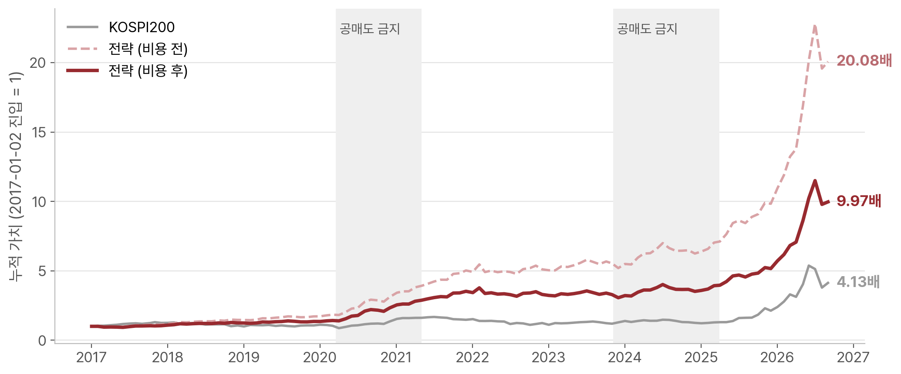

### 0-2. 체결률 고려 여부 비교 (v8 vs v7)

| | **v8 · 체결률 고려 (메인)** | v7 · 체결률 미고려 |
|---|---:|---:|
| 비중 | 최소분산 + √거래대금 혼합 (롱 0.65 · 숏 0.7) | 최소분산 |
| Sharpe | **1.26** | 1.48 |
| CAGR / 연 변동성 | 26.9% / 18.7% | 23.6% / 13.6% |
| MDD / 최악의 달 | −18.9% / −14.9% | −11.0% / −9.2% |
| S1 / S2 / S3 | 1.05 / 1.42 / 1.37 | 1.57 / 1.57 / 1.31 |
| 손실 연도 | 2 | 0 |
| FF3 알파 (t) | 16.4% (3.13) | 17.2% (4.11) |
| 숏 운용월 KOSPI200 베타 | 0.28 | 0.12 |
| 연 회전율 / 비용 | 20.7회 / 7.4% | 24.9회 / 8.4% |
| **1,000억 매매 체결률 (5일, 롱 / 숏)** | **81% / 80%** | **49% / 55% (전체 50.7%)** |
| **체결률 80% 운용 가능 규모 (롱·숏 각)** | **약 1,000억** | **약 125억** |

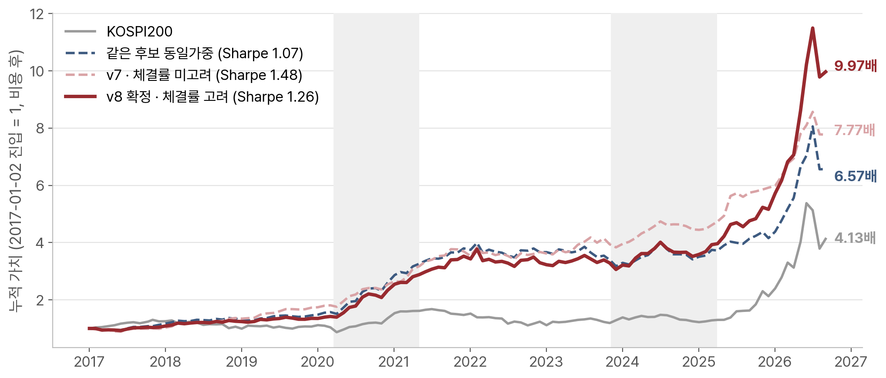

- **v7은 성과가 좋지만 크게 운용할 수 없다.** 거래대금의 10%를 5일 동안 쓴다고 할 때 1,000억에서는 주문의 **약 50%**만 체결된다. 80% 이상 체결되는 규모는 **롱·숏 각 약 125억**이다.
- **v8은 1,000억에서도 80% 이상 체결되도록 비중을 바꾼 버전이다.** 대가로 Sharpe가 1.48 → 1.26, 변동성 13.6% → 18.7%, MDD −11.0% → −18.9%가 된다. 거래가 많은 대형주 쪽으로 비중이 옮겨가 **시장과 같이 움직이는 몫**이 커지기 때문이다(베타 0.12 → 0.28).
- **큰돈에서 남는 것은 신호(SUR·커버일수)의 알파다.** 최소분산이 거래가 적은 저변동 종목에 싣던 효과는 체결률을 맞추면서 대부분 사라진다(8-6).

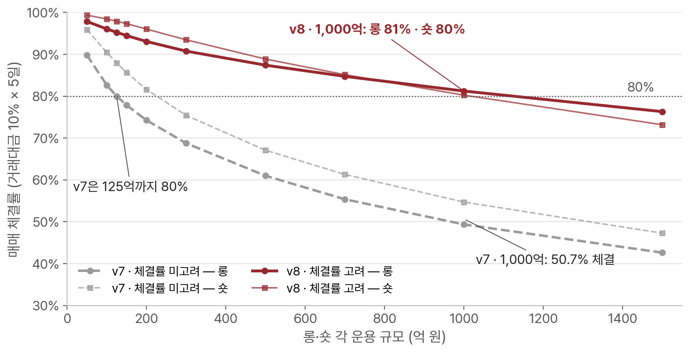

### 0-3. 확정 규칙 요약

| 구분 | 규칙 |
|---|---|
| **롱 후보** | 보통주 시가총액 상위 30% 중 **SUR 상위 10%** (월 34~41종목, 평균 36.7) |
| **숏 후보** | KOSPI200(과열·롱 종목 제외) 중 **커버일수 상위 10%** (월 16~19종목, 평균 17.9), 업종당 최대 3종목 |
| **비중** | **(1 − a) × 최소분산 + a × √(21일 평균 거래대금) 비례**, a = 롱 0.65 · 숏 0.7. 최소분산 공분산 = 252일 Ledoit-Wolf 상관 × 지수가중(반감 20일) 변동성. 혼합 뒤 **롱·숏 모두 한 업종 비중 ≤ 30%** |
| **밴드** | 롱·숏 모두 **2배** |
| **교체** | 롱·숏 모두 **매월** |
| **노출** | **롱 100% / 숏 100% (gross 200%, net 0%)**. 공매도 금지 기간은 롱 100%만 |
| **손절** | 숏 진입가 대비 종가 **+30%** → 다음 거래일 종가 환매 |
| **체결** | 월말 종가 신호 → **다음 거래일 종가** 진입·청산 |
| **운용 규모** | **롱·숏 각 1,000억 기준** — 21일 거래대금 × 10% × 5일 안에 매매의 81%(롱) / 80%(숏) 체결 |
| **비용·이자** | 왕복 50bp, 대차 연 3%, 숏 매도대금 CD91 이자 수취 |

---

## 1. 전략 구조 한 장 요약

```
[매월 말 종가]
   │
   ├─ 롱 유니버스 (보통주 시총 상위 30%, 거래정지 제외)
   │     └─ SUR = EPS 1개월 변화율 ÷ 과거 12개월 변화율 표준편차
   │           └─ 상위 10% 후보 (밴드 2배) ── 0.35 × 최소분산 + 0.65 × √거래대금 → 업종 비중 ≤ 30% ── 롱 100%
   │
   ├─ 숏 유니버스 (KOSPI200, 과열·롱 종목 제외)
   │     └─ 커버일수 = 공매도잔고비율 ÷ 21일 평균 회전율
   │           └─ 상위 10% 후보 (업종당 3, 밴드 2배, 매월 교체) ── 0.3 × 최소분산 + 0.7 × √거래대금 → 업종 비중 ≤ 30% ── 숏 100%
   │
[다음 거래일 종가에 진입] → 한 달 보유 (숏은 +30% 손절) → [다음 달 같은 시점 종가에 청산]
```

**역할 분담:** SUR과 커버일수는 **무엇을 살지·팔지(후보)**를 정하고, 최소분산과 거래대금은 그 후보 안에서 **얼마씩 담을지(비중)**를 정한다. 최소분산은 위험을 줄이고, 거래대금은 체결을 가능하게 한다.

---

## 2. 데이터·기간·체결·비용

### 2-1. 데이터 (DataGuide·KRX 원천 `data/raw/` → 가공 `data/processed/`)

| 역할 | 항목 | 주기 | 시작 |
|---|---|---|---|
| 수익률·체결·위험 추정 | 현금배당 포함 수정종가 (`px_close_tr`) | 일간 | 1999 |
| 롱 신호 | 컨센서스 EPS 1개월 변화율 FY1·FY2 | 월간 | 2006-01 |
| 숏 신호 | 차입공매도잔고비율 (T+2 공시), 거래대금, 시가총액 | 일간 | 잔고 2016-06, 나머지 2012-01 |
| 숏 실행 조건 | 공매도 과열종목 지정(KRX), 공매도 금지 기간 | 일간 | |
| 업종 | FnGuide Industry Group 27 (신호일 기준). **결측은 네이버증권 업종(IG27로 대응)으로 채움** — 아래 참고 | 월간 | |
| 무위험수익률 | CD91 | 월간 | 2012-01 |
| 요인·벤치마크 | FF3 (SMB·HML), KOSPI200, 신 시장 포트폴리오 (10절) | 일간·월간 | |

> **업종 결측 채움 (2026-09-28, DataGuide·KRX 외에 쓴 유일한 자료):** FnGuide 업종 파일은 매달 약 500종목만 분류돼 있어, 보유 종목 중 롱 8.3%·숏 1.5%(금호타이어 22개월, 삼성에피스홀딩스 1개월)가 비어 있었다. 이 경우 업종당 3종목 상한은 적용되지 않고 비중 30% 상한은 "미분류" 한 업종으로 묶여 규칙이 어긋났다. 비어 있는 칸만 **네이버증권 업종**으로 채웠다(원래 값은 그대로). 네이버 업종 → IG27 대응은 IG27이 있는 568종목의 다수결로 정했고, 상장폐지로 네이버에 없는 10종목은 data의 다른 달 업종, 그마저 없는 1종목(맘스터치)은 외식업 → 소비자서비스로 판단해 넣었다. 네이버로 채운 값은 data의 다른 달 업종과 96% 일치한다. 네이버 업종은 현재 시점 분류라 과거 달에 쓰면 약간의 미래정보가 된다. 성과 영향은 v6 기준 Sharpe 1.287 → 1.285. v7에서는 롱 업종 비중 상한도 이 업종을 쓰며, 채운 뒤 보유 종목의 업종 빈칸은 0건이다. 채움표 `data/processed/industry_fill.csv`.

**업종 결측을 어떻게 채웠나 — 네이버 업종 → IG27 대응**

두 분류 체계가 다르다.

| | 데이터가이드 (FnGuide IG27) | 네이버증권 |
|---|---|---|
| 업종 수 | **27개** (크게 묶음) | **79개** (잘게 나눔) |
| 예 | 의료, 하드웨어, 자동차및부품 | 제약, 생물공학, 건강관리장비와용품, 전자장비와기기, 핸드셋 |

우리 규칙(업종당 3종목, 업종 비중 30%)은 IG27 기준이라, 네이버 업종을 IG27 이름으로 바꿔야 했다. 이 대응표는 손으로 정하지 않고 데이터로 만들었다.

1. 두 업종이 다 있는 종목 568개를 모은다.
2. 네이버 업종별로 그 종목들의 IG27 업종을 센다.
3. 가장 많은 IG27 업종을 짝으로 정한다. (예: 네이버 "제약" 41종목은 IG27에서 41개 모두 "의료" → 제약 → 의료)

**대부분 딱 맞는다** — 네이버 업종 64개 중 55개가 100% 일치

| 네이버 업종 | → IG27 | 일치 |
|---|---|---:|
| 제약 | 의료 | 41 / 41 |
| 생물공학 | 의료 | 11 / 11 |
| 반도체와반도체장비 | 반도체 | 56 / 56 |
| 자동차부품 · 자동차 | 자동차및부품 | 22 / 22 · 6 / 6 |
| 식품 | 음식료및담배 | 18 / 18 |
| 화장품 | 생활용품 | 13 / 13 |
| 우주항공과국방 | 상업서비스 | 11 / 11 |

**어긋나는 경우** — 네이버 업종 하나가 IG27 두 곳에 걸침

| 네이버 업종 | 다수결 IG27 | 일치 | 나머지 |
|---|---|---:|---|
| 가스유틸리티 | 에너지 | 2 / 4 | 유틸리티 등 |
| 건축자재 | 기타 소재 | 5 / 9 | 건설 등 |
| 전기유틸리티 | 유틸리티 | 2 / 3 | |
| 전기제품 | 하드웨어 | 18 / 20 | 기타자본재 |
| 화학 | 화학 | 35 / 38 | 반도체·하드웨어 (2차전지 소재) |

**검증:** 네이버로 채운 종목 중 같은 종목이 데이터가이드의 다른 달에 업종이 있던 134종목을 비교하면 **96%(129종목)가 같다.** 다른 5종목(삼화콘덴서·삼영전자·감성코퍼레이션·에코프로·원익머트리얼즈)은 모두 롱 후보다. 상장폐지로 네이버에 없는 10종목은 데이터가이드의 다른 달 업종을, 그마저 없는 맘스터치는 외식업 → 소비자서비스로 판단해 넣었다. 대응표·채움표: `data/processed/naver_to_ig27_map.csv`, `industry_fill.csv` (원천 `data/raw/naver/`).


### 2-2. 기간

- 차입공매도잔고비율 자료가 **2016년 6월**에 시작돼, 숏을 운용할 수 있는 첫 신호월이 **2016-12**다.
- 첫 진입 **2017-01-02**, 마지막 청산 **2026-09-01**, 116개월. **숏 운용 86개월 + 공매도 금지로 롱만 보유한 30개월.**

### 2-3. 체결

| 항목 | 규칙 |
|---|---|
| 신호 | 매월 마지막 거래일 **종가** 기준 |
| 진입 | **다음 거래일 종가** |
| 청산 | 다음 달 마지막 거래일의 **다음 거래일 종가** |
| 체결 가정 | 백테스트는 목표 비중대로 체결. 롱·숏 각 1,000억 기준 매매 체결률 81% / 80%가 되도록 비중을 정함 (6-8, 8-6) |
| 거래정지 | 신호일 기준 최근 5거래일 연속 거래가 없으면 후보 제외 |

### 2-4. 비용과 수익률 정의

| 항목 | 가정 |
|---|---|
| 거래비용 | 왕복 50bp (매수·매도 각 25bp) — 회전율에 비례 |
| 대차비용 | 숏 금액 × 연 3%. 손절한 종목은 실제 보유 거래일 비율만큼 |
| 회전율 | \|새 목표 비중 − 직전 보유가 한 달 수익률로 떠내려간 비중\|의 합. 손절한 숏은 청산 매수 1회로 세고 다음 달은 보유 0에서 출발 (2026-09-30 포지션 회계 수정, 문서 머리말 참고) |
| 무위험수익률 | CD91. **숏 매도대금(담보)은 CD91 이자를 받는다고 가정** — 숏 운용월에 숏 금액 × 그달 CD91을 수익에 더함(연평균 +1.6%, 손절 종목은 보유 거래일만큼). 롱에 들어간 투자금은 CD91을 차감해 초과수익을 계산. 이자를 0으로 두면 v8 Sharpe 1.17 (v7 1.36) |
| 배당 | 수정종가에 현금배당 반영 → 롱은 배당을 받고, 숏은 배당 보전 비용을 자동으로 부담 |
| 기준 | CAGR·MDD·누적은 **총수익**, Sharpe·알파는 **CD91 차감 초과수익** |

---

## 3. 롱 신호 — SUR (표준화 리비전)

### 3-1. 한 줄 정의

> **SUR(Standardized Unexpected Revision) = 이번 달 EPS 변화율 ÷ 그 종목이 평소 보이던 EPS 변화율의 표준편차**

"이번 달 리비전이 **그 종목 기준으로** 얼마나 이례적인가"를 재는 숫자다.

### 3-2. 투자 논리

- **애널리스트 전망 상향은 주가에 한 번에 반영되지 않는다.** 전망 수정 후 수개월간 주가가 같은 방향으로 움직이는 현상을 **전망 수정 후 드리프트(PFRD)**라고 한다 (Stickel 1991; Chan, Jegadeesh & Lakonishok 1996).
- 그런데 **같은 크기의 상향이라도 종목마다 의미가 다르다.** 전망이 늘 크게 출렁이는 종목의 +5%는 잡음이고, 평소 조용하던 종목의 +5%는 큰 뉴스다.
- SUR은 이 차이를 반영해 **"평소보다 크게 상향된" 종목**을 고른다.

### 3-3. 비유 — 평소 조용하던 사람이 소리치면

- 매일 소리치는 사람이 한 번 더 소리쳐도 아무도 돌아보지 않는다.
- 평소 조용하던 사람이 소리치면 무슨 일이 생긴 것이다.

리비전도 같다. 매달 ±15%씩 오르내리는 종목의 +5%는 **늘 있는 일**이고, 매달 ±2%만 움직이던 종목의 +5%는 **평소의 3배**다. 원 리비전은 둘을 똑같이 취급하지만, SUR은 후자를 훨씬 높게 친다.

### 3-4. 실제 예시 (2026-07-31 신호)

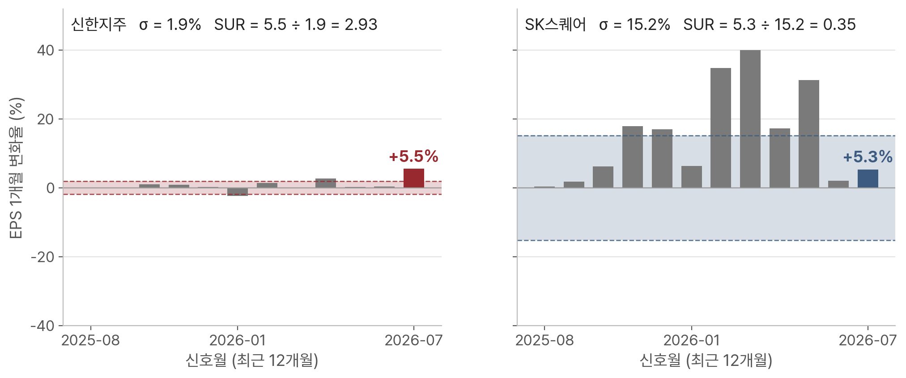

| | 신한지주 | SK스퀘어 |
|---|---:|---:|
| 이번 달 EPS 변화율 | **+5.5%** | **+5.3%** |
| 과거 12개월 변화율 표준편차 σ | **1.9%** | **15.2%** |
| **SUR** | 5.5 ÷ 1.9 = **2.93** | 5.3 ÷ 15.2 = **0.35** |
| 원 리비전 순위 (397종목 중) | 56위 | 58위 |
| **SUR 순위** | **5위** | 110위 |

리비전 크기는 거의 같다. 하지만 신한지주는 평소 거의 움직이지 않던 리비전이 한 번에 뛴 것이고, SK스퀘어는 평소 변동 범위(음영) 안의 값이다. 원 리비전으로는 둘 다 탈락(56·58위)이지만, SUR로는 신한지주가 5위로 선정된다.

### 3-5. 수식과 계산 순서

$$
\text{SUR}_{i,t} = \frac{r_{i,t}}{\sigma_{i,t}}, \qquad
\sigma_{i,t} = \text{표준편차}\big(r_{i,t-11},\ r_{i,t-10},\ \dots,\ r_{i,t}\big)
$$

| 단계 | 내용 |
|---|---|
| ① 원 리비전 $r_{i,t}$ | 컨센서스 EPS 1개월 변화율(%). **1~10월은 FY1(올해), 11~12월은 FY2(내년)** |
| ② 극단값 처리 | 매달 롱 유니버스 안에서 상·하위 1%를 1%·99% 값으로 자른다 (윈저라이즈) |
| ③ 분모 $\sigma_{i,t}$ | 그 종목의 **최근 12개월**(당월 포함) 변화율 표준편차. 12개월 중 **8개월 이상** 값이 있어야 계산 |
| ④ SUR | ① ÷ ③ |

**세부 규칙과 이유**

| 규칙 | 이유 |
|---|---|
| **11월부터 FY2로 전환** | 연말이 가까워지면 올해 실적은 거의 확정돼 수정이 줄고, 시장 관심이 내년으로 옮겨간다 |
| **분모에 당월 포함** | 당월 리비전은 신호일에 이미 공개된 값이라 미래정보가 아니다. 한 달만 튀는 리비전은 스스로 분모를 키워 과도하게 뽑히지 않는다 |
| **최소 8개월 이력** | 표준편차를 믿을 만하게 추정하려면 관측치가 필요하다. 12개월의 약 3분의 2로 잡은 관례값이며, 튜닝하지 않았다 |
| **이력 부족 종목 제외** | 컨센서스가 없던 달(신규 상장·신규 커버리지)과 유니버스 밖에 있던 달은 결측이다. 롱 유니버스(월평균 431종목)의 약 **85%(367종목)**가 SUR 대상이다 |
| **음수 SUR** | 리비전이 하향이면 SUR도 음수라 상위에 들지 않는다. 롱은 "평소보다 크게 상향된 종목"만 산다 |

### 3-6. 왜 표준편차로 나누나 — 통계적 의미

- **z-점수와 같은 원리다.** 척도가 다른 값을 "평소 흔들림의 몇 배인가"라는 같은 단위로 바꾼다.
- **신호 대 잡음비다.** 분자는 신호(이번 뉴스), 분모는 잡음(평소 흔들림)이다.
- **원 리비전은 잡음이 큰 종목으로 쏠린다.** 전 기간 매달 상위 30종목의 σ 중앙값을 비교했다.

| | 상위 30의 σ (중앙) | 상위 30의 리비전 (중앙) |
|---|---:|---:|
| 롱 유니버스 전체 | 6.4% | — |
| **원 리비전 상위 30** | **11.4%** (유니버스보다 잡음이 큼) | 12.9% |
| **SUR 상위 30** | **5.8%** (유니버스 평균 수준) | 8.7% |
| 두 방식이 같은 종목 | 월평균 20 / 30 | |

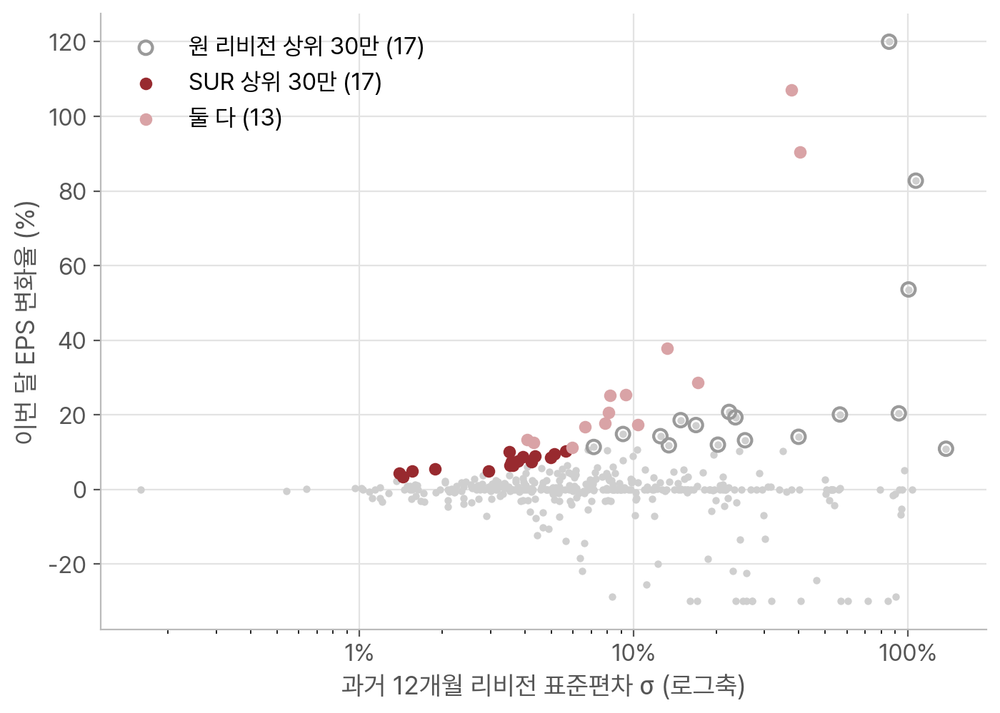

회색 빈 원(원 리비전만 고른 종목)은 오른쪽, 즉 평소 리비전이 크게 흔들리는 종목에 몰려 있다. SUR은 이 종목들을 빼고 왼쪽(평소 안정적인데 이번에 상향된 종목)을 채운다.

### 3-7. 이론적 근거

| 문헌 | 내용 |
|---|---|
| Foster, Olsen & Shevlin (1984), *The Accounting Review* | 이익 서프라이즈를 **과거 서프라이즈의 표준편차로 나눈 SUE**를 정의. 이익 발표 후 드리프트(PEAD) 연구의 표준 척도 |
| Bernard & Thomas (1989), *Journal of Accounting Research* | SUE 상위 종목은 발표 후 60일간 계속 오름 |
| Stickel (1991), *The Accounting Review* | 애널리스트 전망 수정 주변의 주가 반응 |
| Chan, Jegadeesh & Lakonishok (1996), *Journal of Finance* | 전망 수정이 이후 수익률을 예측 (리비전 모멘텀) |

**SUR은 SUE의 표준화 아이디어를 리비전에 그대로 적용한 것이다.** SUE는 실적 발표(분기 1회)를, SUR은 컨센서스 수정(매월)을 쓴다.

### 3-8. 신호 검증

**5분위 (롱 유니버스, 다음 달 수익률, 동일가중, 116개월)**

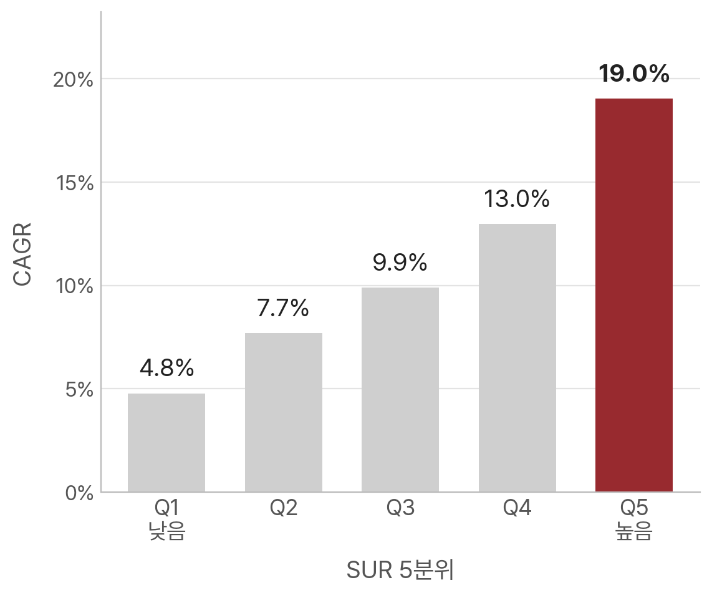

| | Q1 (낮음) | Q2 | Q3 | Q4 | **Q5 (높음)** | **Q5 − Q1** |
|---|---:|---:|---:|---:|---:|---:|
| **SUR** CAGR | 4.8% | 7.7% | 9.9% | 13.0% | **19.0%** | **+12.8%p (t 4.58)** |
| 원 리비전 CAGR | 6.2% | 6.9% | 8.2% | 11.2% | 16.6% | +9.2%p (t 3.07) |

- Q1에서 Q5로 **단조롭게** 올라간다.
- 원 리비전보다 스프레드가 **3.6%p 크고** t값도 높다.

**구간별 검증 (Fama-MacBeth 회귀, 동료 SUR·이익수익률을 함께 통제)**

| 구간 | SUR 계수 (연) | t |
|---|---:|---:|
| 백테스트 이전 2012-08 ~ 2016-11 | +17.3% | 3.16 |
| 백테스트 기간 2016-12 ~ 2026-07 | +15.5% | **5.13** |

두 구간 모두 유의하고, 다른 신호를 통제해도 유지된다. 다만 **표본 밖 검증은 아니다.** SUR 설정(12개월 창 등)은 백테스트 기간 결과를 보고 정했고, 커버일수는 차입공매도잔고 데이터가 2016-06부터라 앞 구간이 없다. 설정 선택을 앞 구간으로만 해 본 것은 11-2 앵커 검증뿐이다.

**시가총액 구간별 (SUR × 시가총액 5×5, 셀 = 다음 달 동일가중 수익률의 CAGR, 116개월)**

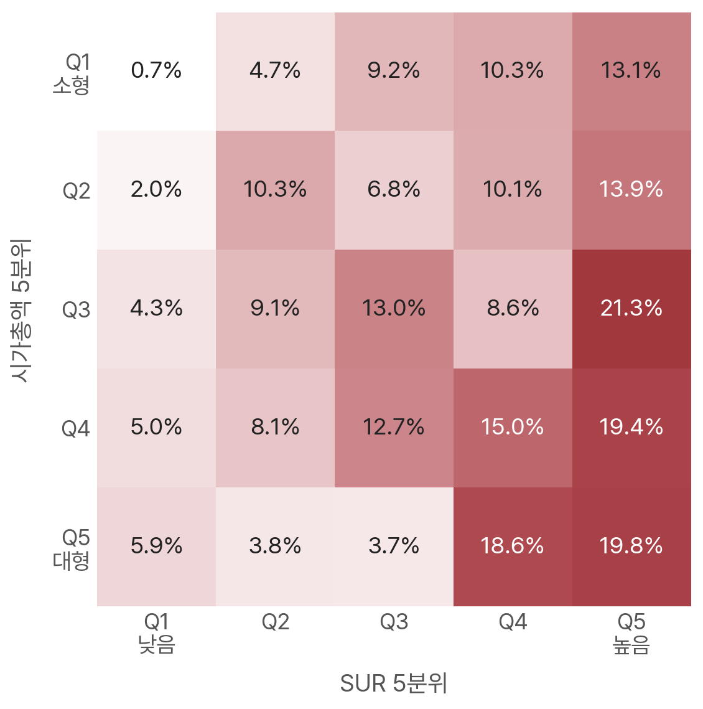

| 시가총액 | SUR Q1 | Q2 | Q3 | Q4 | **SUR Q5** | **Q5 − Q1** |
|---|---:|---:|---:|---:|---:|---:|
| Q1 소형 | 0.7% | 4.7% | 9.2% | 10.3% | 13.1% | **+12.4%p** |
| Q2 | 2.0% | 10.3% | 6.8% | 10.1% | 13.9% | **+11.9%p** |
| Q3 | 4.3% | 9.1% | 13.0% | 8.6% | 21.3% | **+17.0%p** |
| Q4 | 5.0% | 8.1% | 12.7% | 15.0% | 19.4% | **+14.4%p** |
| Q5 대형 | 5.9% | 3.8% | 3.7% | 18.6% | 19.8% | **+13.8%p** |

- **다섯 시총 구간 모두 SUR 최상위(Q5)가 최하위(Q1)보다 12~17%p 높다.** SUR 효과는 특정 규모에 몰려 있지 않다.
- 셀당 평균 15종목이라 중간 칸은 일부 뒤바뀐다. 3×3으로 묶으면(셀당 41종목) 모든 시총 구간에서 Q3−Q1이 +9.3~+11.8%p다.
- 3×3·4×4 그림: `figures/fig_sur_3x3.png`, `fig_sur_4x4.png` (커버일수는 `fig_dtc_3x3.png`, `fig_dtc_4x4.png`)

### 3-9. SUR은 z-score와 무엇이 다른가

**비슷한 점:** 둘 다 "표준편차로 나눠서 평소 흔들림 대비 몇 배인지"를 본다.

**다른 점은 두 가지다.**

| | 흔한 z-score | **SUR** |
|---|---|---|
| **① 누구와 비교하나** | 보통 **그달의 다른 종목들**과 비교 (횡단면 z) | **그 종목의 과거 자신**과 비교 (시계열) |
| **② 평균을 빼나** | 뺀다: (x − 평균) ÷ 표준편차 | **빼지 않는다: r ÷ σ** |

**① 횡단면 z-score는 순위를 바꾸지 못한다.**
그달 모든 종목에 같은 평균을 빼고 같은 표준편차로 나누므로, 원 리비전과 **순위가 완전히 같다**(순위상관 1.00). 상위 10%를 고르는 전략에서는 아무 효과가 없다. SUR은 **종목마다 분모(σ)가 달라서** 순위가 바뀐다. 그래서 효과가 난다.

**② 평균을 빼지 않는 이유 — "기대 리비전은 0"이라고 본다.**
- SUR의 원형인 SUE는 (실제 이익 − 기대 이익) ÷ σ다. 리비전은 이미 "전망의 변화"라서, **애널리스트 전망이 효율적이라면 다음 수정의 기댓값은 0**이다. 그래서 r 자체가 "예상 밖(Unexpected)" 부분이고, 평균을 뺄 필요가 없다.
- 평균을 빼면(자기이력 z) **늘 상향되던 종목이 또 상향돼도 점수가 0 근처로 깎인다.** 리비전은 1~2개월 연속되는 경향(드리프트)이 있어서, 연속 상향은 오히려 좋은 신호인데 그걸 지우게 된다.

**실제 비교 (v8 설정에서 롱 신호만 교체)**

| 롱 신호 | 식 | Sharpe | CAGR | MDD |
|---|---|---:|---:|---:|
| **SUR (확정)** | r ÷ σ | **1.26** | **26.9%** | −18.9% |
| 자기이력 z | (r − 과거 12개월 평균) ÷ σ | 1.05 | 19.2% | −16.4% |
| 횡단면 z | (r − 그달 평균) ÷ 그달 표준편차 | 1.06 | 22.4% | −25.3% |
| 원 리비전 | r | 1.06 | 22.4% | −25.3% |

- 횡단면 z는 원 리비전과 **결과까지 똑같다** (순위가 같으므로).
- 자기이력 z는 SUR 상위 10%와 종목이 72% 겹치지만, 연속 상향 종목을 깎아 CAGR이 8%p 낮다.
- 체결률을 고려한 v8에서는 SUR과 원 리비전의 차이가 줄어든다(1.26 vs 1.06, v7에서는 1.48 vs 0.79). 거래대금 비중이 섞이면서 SUR이 걸러내던 잡음 큰 종목의 영향도 함께 줄기 때문이다.

**한 줄 답변:** "z-score처럼 표준편차로 나누지만, ① 다른 종목이 아니라 **그 종목의 과거**와 비교하고 ② 평균을 빼지 않습니다. 리비전의 기댓값은 0이라 리비전 자체가 '예상 밖' 부분이기 때문입니다. 그달 전체로 z-score를 내면 순위가 원 리비전과 똑같아 효과가 없습니다."

### 3-10. 예상 질문

**Q. 결국 변동성 낮은 종목을 고르는 저변동성 전략 아닌가?**
> 아닙니다. 분모는 **주가 변동성이 아니라 리비전의 변동성**입니다. 리비전을 주가 변동성으로 나누는 방식도 검정했는데 원 리비전보다 나빴습니다. SUR 상위 30의 σ(5.8%)는 유니버스 평균(6.4%)과 비슷합니다. 저변동 종목에 쏠리는 것이 아니라 **잡음이 큰 종목으로의 쏠림을 걷어낸 것**입니다.

**Q. 분모가 0에 가까우면 SUR이 폭발하지 않나?**
> 분모에 당월 리비전이 들어가서, 한 달만 크게 튄 리비전은 스스로 분모를 키웁니다. 11개월 동안 0이던 종목이 이번 달 x만큼 뛰면 σ = |x| ÷ √12라 SUR은 √12 ≈ 3.5에서 멈춥니다. 실제 최대값도 3.75이고 4를 넘은 적이 없습니다(116개월, 5만 5천 개 관측). 윈저라이즈는 분자인 리비전의 극단값을 자르는 별도 처리입니다. 롱 후보의 σ는 하위 1%가 0.85%, 중앙이 5.8%입니다.

**Q. 과거 12개월을 보면 느린 신호 아닌가?**
> 12개월은 **분모(잣대)**에만 씁니다. 분자(이번 달 리비전)는 매달 새로 나옵니다. 평활처럼 과거 리비전을 섞는 방식이 아닙니다.

**Q. 이력이 짧은 종목이 빠지는 게 문제 아닌가?**
> 약 15%가 빠집니다. 컨센서스 이력이 짧은 종목은 원래 리비전 잡음이 커서 빠져도 손실이 작습니다.

---

## 4. 숏 신호 — 커버일수 (Days to Cover)

### 4-1. 정의

$$
\text{커버일수}_{i,t} = \frac{\text{차입공매도잔고비율}_{i,t-3}}{\text{21일 평균 일간 거래회전율}_{i,t}}
$$

- **공매도한 물량을 평소 거래량으로 되사는 데 며칠이 걸리는가**를 뜻한다.
- 잔고비율은 **T+2일 공시**라 3거래일 전 값을 쓴다 (미래정보 방지).

### 4-2. 투자 논리

- **공매도는 비싸고 위험하다.** 대차료를 내고, 스퀴즈 위험을 지고, 되사는 데 시간이 걸린다. 그런데도 거래가 적은 종목에 공매도가 두껍게 쌓였다면, **그 비용을 감수할 만큼 확신이 강하다**는 뜻이다.
- 잔고비율만 보면 거래가 많아 빠져나오기 쉬운 종목에 잔고가 과하게 쌓인다 (Boehmer, Jones & Zhang 2008). **회전율로 나누면 "비용을 감수한 확신의 강도"**가 된다.
- 미국에서 커버일수는 이후 저조한 수익률과 연결됐고 (Hong et al. 2015), 38개국 분석에서도 여러 공매도 지표 중 비교적 견고했다 (Boehmer et al. 2022).

**예시 (2026-03-31):** 한미반도체는 잔고비율(5.59%)이 동서(1.37%)의 4배지만 회전율도 커서(1.63% vs 0.09%), 커버일수는 동서가 15.5일로 한미반도체(3.4일)보다 훨씬 강한 숏 신호다.

### 4-3. 숏 유니버스

| 항목 | 규칙 |
|---|---|
| 범위 | **KOSPI200 편입 종목** |
| 제외 | 공매도 과열종목, 거래정지 종목, **롱 후보와 겹치는 종목** |
| 공매도 금지 기간 | 숏 없음 (롱만 보유) |
| 크기 | 월 161~187종목 (중앙 178) |

**왜 KOSPI200인가:** 공매도 잔고는 빌릴 수 있는 종목에서만 쌓인다. KOSPI200은 대차 공급이 가장 두껍고 규제에 덜 걸린다. 또 커버일수 효과는 대형주에서 가장 뚜렷했다 (시총×커버일수 히트맵).

**커버일수 × 시가총액 (KOSPI200 안에서 5×5, 숏 운용 86개월, CAGR)**

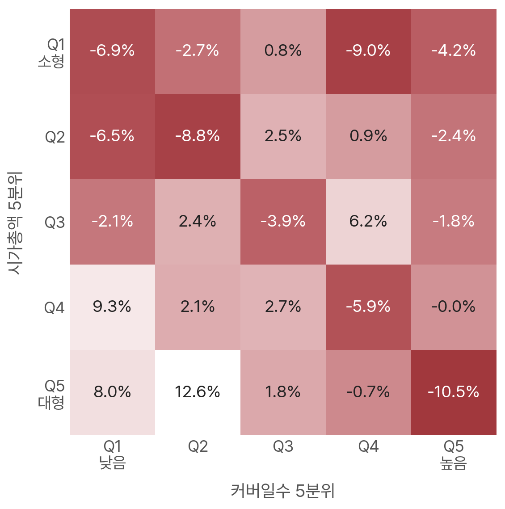

| 시가총액 | 커버일수 Q1 | Q2 | Q3 | Q4 | **커버일수 Q5** | **Q5 − Q1** |
|---|---:|---:|---:|---:|---:|---:|
| Q1 (KOSPI200 내 소형) | −6.9% | −2.7% | 0.8% | −9.0% | −4.2% | +2.8%p |
| Q2 | −6.5% | −8.8% | 2.5% | 0.9% | −2.4% | +4.1%p |
| Q3 | −2.1% | 2.4% | −3.9% | 6.2% | −1.8% | +0.3%p |
| Q4 | 9.3% | 2.1% | 2.7% | −5.9% | −0.0% | **−9.3%p** |
| Q5 대형 | 8.0% | 12.6% | 1.8% | −0.7% | −10.5% | **−18.4%p** |

- **커버일수 효과는 대형주에서 뚜렷하다.** 대형 구간에서 커버일수 최하위 8.0% → 최상위 −10.5%로 18.4%p 차이다. 3×3으로 묶어도 대형 구간 9.6% → −3.4%(−13.0%p).
- **커버일수 최상위(Q5)는 다섯 시총 구간 모두 0% 이하**다.
- KOSPI200 안의 소형 구간은 효과가 흐리다. 셀당 평균 8종목이라 잡음이 크다. 과거에는 "시총 상위 30%" 조건도 있었지만, KOSPI200 종목 중 이 조건에 걸리는 종목은 한 달 최대 3개뿐이고 결과가 소수점까지 같아 삭제했다.

### 4-4. 숏은 매월 교체 (v6 변경)

v5는 "커버일수는 천천히 변하는 재고 변수"라는 논리로 숏을 2개월마다 바꿨다. 그런데 **2개월을 어느 달부터 세느냐에 따라 성과가 크게 갈렸다.**

| (v5 설정) | Sharpe | MDD |
|---|---:|---:|
| 2개월 교체, 2016-12부터 시작 (v5 발표 수치) | 1.32 | −12.2% |
| 2개월 교체, 한 달 늦게 시작 | **1.01** | **−24.4%** |
| 매월 교체 | 1.17 | −17.4% |

규칙은 같은데 시작 날짜만 다르게 해도 0.3 차이가 난다. 즉 v5의 1.32에는 **날짜 운**이 섞여 있었다. **v6는 매월 교체해 이 운을 없앤다.** 비용은 연 0.8%p 늘지만(7.7% → 8.5%), 비용 후에도 운을 뺀 v5보다 좋다.

- 커버일수 효과 자체는 천천히 나타난다(편입 후 1·2·3개월째 −0.31% · −0.42% · **−0.81%(t −2.53)**, 다음 달에도 상위 10%에 남는 비율 69%). 매월 교체해도 대부분의 종목은 그대로 유지되므로 이 효과를 계속 받는다.
- 커버일수 **수준**은 이후 수익률을 예측하지만 **변화**는 예측하지 못한다(변화 5분위 Q5−Q1 t −0.06).
- v8에서 교체 주기를 바꾸면: 매월 **1.26** · 2개월 1.38(v5 시작) / 1.13(한 달 늦게), **평균 1.25** · 3개월 1.27(시작 달 세 가지 1.27 / 1.10 / 1.09). **2개월 평균과 매월이 거의 같으므로 운에 기대지 않는 매월**을 쓴다.

### 4-5. 업종 상한 — 종목 수 3개 + 비중 30%

**① 종목 수: 업종당 최대 3종목 (후보 단계)**

- 커버일수 상위 종목은 **의료·음식료처럼 특정 업종에 몰린다.** 상한 없이 상위 10%(평균 17.9종목)를 뽑으면 한 업종 최대가 평균 3.6종목, 최대 6종목이고, **52%의 달에 한 업종에 4종목 이상** 몰린다(의료 31개월, 자동차 18개월, 음식료 15개월). 상한 3으로 바뀌는 종목은 월평균 0.74개다.
- 그 업종이 한꺼번에 반등하면 숏 전체가 같이 당하는데, **개별 종목 손절로는 이걸 못 막는다.**
- v8 민감도: 2종목 1.36 · **3종목 1.26** · 4종목 1.17 · 없음 1.16. 2종목이 더 높지만, 상한 3은 v5에서 앵커 검증으로 정한 값이라 바꾸지 않았다(13절).

**② 비중: 한 업종 비중 ≤ 30% (비중 단계, v6 추가)**

종목 수 상한만으로는 부족했다. 최소분산은 변동성이 낮은 방어주에 비중을 몰아주는데, 커버일수 상위의 방어주는 대부분 **음식료**다. 그래서 3종목만 들어와도 그 업종이 숏의 절반 넘게 차지했다.

| 숏 운용 86개월 (v6 설계 당시 점검) | 종목 수 상한만 | **+ 업종 비중 30%** |
|---|---:|---:|
| 한 종목 최대 비중 (평균 / 최대) | 29.9% / 57.8% | **23.8% / 30.0%** |
| 한 업종 최대 비중 (평균 / 최대) | 37.1% / 80.5% | **27.9% / 30.0%** |
| 한 종목 30% 넘은 달 | 37개월 | **0개월** |
| 한 업종 50% 넘은 달 | 14개월 | **0개월** |
| 음식료 평균 비중 | 26.2% | **20.9%** |
| 숏 유효 종목 수 | 6.4 | **7.3** |

- **규칙:** 최소분산 비중을 구한 뒤 30%를 넘는 업종은 30%로 줄이고, 줄인 몫은 **30%에 여유가 있는 업종의 종목들에 원래 비중 비율대로** 나눠 준다. 최소분산이 비중 0을 준 종목은 다른 방법이 없을 때만 받는다. 한 종목은 자기 업종보다 클 수 없으므로 **한 종목도 자동으로 30% 이하**다.
- **왜 30%인가 — 손절선과 짝:** 숏 손절선이 +30%다. 한 업종 30% × 그 업종 30% 동반 급등 × 숏 100% = **NAV의 9%**. "한 종목이든 한 업종 전체든 손절선까지 올라도 손실이 NAV의 약 10%를 넘지 않게 하는 한도"다.
- **성과로 고른 값이 아니다.** v8에서 숏 상한 20% 1.26 · 25% 1.26 · **30% 1.26** · 35% 1.26 · 40% 1.26 · 없음 1.26 — 거래대금 혼합으로 비중이 이미 고르게 퍼져 상한이 거의 걸리지 않는다(한 업종 최대 평균 20.1%). v6 설계 당시 상한 없음과의 연 초과수익 차이는 모두 유의하지 않았다(t −0.2 ~ −1.4). 30%는 표본 안 최적값(20~25%)도 아니다.
- **폭락장에서 도움이 된다.** 2026년 7월(KOSPI200 −26.1%) 숏 다리 손익이 −3.4%에서 −2.6%로 줄었다. 시장이 26% 빠진 달에 음식료 방어주 숏이 오히려 올랐기 때문이다.

### 4-6. 손절 +30% — 숏 스퀴즈 보험

**숏 스퀴즈:** 공매도한 투자자들이 손실을 막으려 한꺼번에 되사면서 주가가 더 오르는 현상. 커버일수가 높은 종목은 출구(거래량)가 좁아 스퀴즈에 구조적으로 약하다. **알파와 위험이 같은 곳에서 나온다.**

| 규칙 | 내용 |
|---|---|
| 발동 | 진입가 대비 **종가 +30%** |
| 청산 | **다음 거래일 종가**에 환매 |
| 이후 | 그 종목 몫은 월말까지 현금 |

**손절 효과 (116개월)**

| 항목 | 값 |
|---|---:|
| 손절 건수 | **38건 (연 3.9건, 86개월 중 24개월)** — v8은 모든 숏 후보에 비중이 있어 발동한 38건이 모두 실제 손절 |
| 손절 후 월말까지 더 올라 손실을 막은 비율 | 50% |
| 막은 경우 평균 회피한 추가 상승 | +16.3%p |
| 손절 체결 시 상승률 | 중앙 +31.8% · 최대 +86.4% |
| **건당 NAV 손실** | **중앙 1.37% · 최대 3.4%** |

- v7에서는 급등한 38종목 중 18종목에 최소분산이 비중 0을 줘서 손절 자체가 없었다. **v8은 거래대금 비중이 섞여 모든 후보에 비중이 생기므로 손절이 20건에서 38건으로 늘었다.**
- **왜 30%인가:** 한국 가격제한폭(±30%)과 같은 기준점이라 튜닝한 숫자가 아니다. 숏 종목의 한 달 변동폭(중앙 11.8%)의 약 2.5배이기도 하다.
- **손절 수준은 결과를 좌우하지 않는다.** v8에서 없음 1.25 · 20% 1.25 · **30% 1.26** · 40% 1.23. 손절은 수익이 아니라 **보험**이다.
- 손절선 +30%는 업종 비중 상한 30%와 짝을 이룬다(4-5 ②).

---

## 5. 종목 수 — 롱·숏 모두 상위 10분위

### 5-1. 규칙

| | 규칙 | 실제 종목 수 |
|---|---|---|
| **롱** | SUR 후보(월평균 367종목) 중 **상위 10%** | 월 34~41, 평균 **36.7** |
| **숏** | 숏 유니버스(월 161~187종목) 중 **상위 10%** | 월 16~19, 평균 **17.9** |
| 밴드 | 둘 다 **2배** — 기존 보유 종목은 목표 종목 수의 2배 순위 안이면 유지 | |

**숏 종목 수 분포 (운용 86개월)**

| 종목 수 | 16 | 17 | 18 | 19 |
|---|---:|---:|---:|---:|
| 개월 | 1 | 11 | 67 | 7 |

### 5-2. 왜 "상위 10%"인가

- **종목 수를 임의로 고정하지 않기 위해서다.** 신호를 10분위로 나눠 극단 분위를 보는 것은 팩터 연구의 표준 관행이다. 유니버스 크기가 달라도 늘 같은 강도의 종목만 담는다.
- **롱·숏에 같은 원칙을 쓴다.**
- **앵커 3구간 검증(v5 엔진, 80개 조합)이 두 번 연속 이 규칙을 골랐다** (11-2절).
- v8 민감도: 롱 8% 1.26 · **10% 1.26** · 12% 1.17 / 숏 8% 1.21 · **10% 1.26** · 12% 1.28 · 15% 1.24. **다소 뾰족하다**(13절 1번).

### 5-3. 밴드 2배

- 좁게 잡으면 매달 교체가 많아 비용이 늘고, 넓게 잡으면 신호가 식은 종목을 오래 든다.
- 2분위 종목을 새 1분위 종목으로 바꿔 얻는 이득(월 0.42%p)이 교체 비용(0.50%)보다 작아 밴드는 필요하다. 다만 "정확히 2배"의 근거는 약하다.
- v8 민감도: 롱 1.5배 1.17 · **2배 1.26** · 2.5배 1.21 / 숏 1.5배 1.23 · **2배 1.26** · 3배 1.26.

---

## 6. 비중 — 최소분산 + √거래대금 혼합 (v8)

> 6-1~6-7은 혼합의 한쪽인 **최소분산**의 설명이고(v7과 같음), **6-8이 v8의 체결률 고려 혼합**이다.

### 6-1. 한 줄 정의

> **고른 후보들 안에서, 포트폴리오 전체 변동성이 가장 작아지도록 비중을 준다.** 필요한 공분산은 **Ledoit-Wolf 방식으로 수축**해 추정 잡음을 줄인다.

### 6-2. 비유 — 같은 선수 명단, 다른 배치

같은 선수 37명을 뽑았어도, 서로 같은 방향으로만 뛰는 선수들을 몰아 세우면 팀이 한쪽으로 쏠린다. 최소분산은 **서로의 움직임을 상쇄해 주는 선수들에게 더 많은 출전 시간을 주는 배치**다. 누가 뛸지는 SUR이 정하고, 얼마나 뛸지는 공분산이 정한다.

### 6-3. 수식

**① 최소분산 비중**

$$
w^{*} = \frac{\hat\Sigma^{-1}\mathbf{1}}{\mathbf{1}^\top \hat\Sigma^{-1}\mathbf{1}}
$$

음수 비중은 0으로 자르고, 나머지를 합이 1이 되도록 다시 나눈다. **롱 후보, 숏 후보에 각각** 적용한다. 그 뒤 롱·숏 모두 **한 업종 비중 ≤ 30%**를 적용한다(4-5 ②, 6-7).

**② Ledoit-Wolf 수축 공분산**

$$
\hat\Sigma = (1-\delta)\,S + \delta\,\mu I, \qquad \mu = \frac{\operatorname{tr}(S)}{n}
$$

| 기호 | 뜻 |
|---|---|
| $S$ | 표본 공분산 (신호일까지 **252거래일** 일간 수익률, 126일 이상 자료가 있는 종목) — **v6에서는 여기서 상관만 쓴다 (6-6)** |
| $\mu I$ | 목표: "모든 종목이 같은 분산을 갖고 서로 무관하다"는 단순한 구조 |
| $\delta$ | **수축 강도.** 추정 오차를 최소화하는 값을 Ledoit & Wolf (2004) 공식이 **자료에서 직접 계산**한다. 사람이 정하지 않는다 |

실제로 추정된 수축 강도는 평균 **롱 0.125, 숏 0.113**이다. 표본 공분산을 88% 정도 믿고, 12% 정도는 단순한 구조 쪽으로 당긴다.

### 6-4. 왜 수축이 필요한가 — 쉽게

**① 최소분산은 "종목들이 서로 어떻게 같이 움직이는지"를 알아야 한다.**
이것(공분산)을 과거 1년(252거래일) 자료로 추정한다. 그런데 37종목이면 두 종목씩 짝지은 관계가 666쌍이다. 666쌍의 관계를 252일치 자료로 추정하면 **우연히 생긴 관계(잡음)가 섞일 수밖에 없다.**

**② 최소분산은 그 잡음까지 진짜로 믿는다.**
지난 1년간 우연히 다른 종목들과 반대로 움직였던 종목이 있으면, 최소분산은 그 종목을 "최고의 분산 수단"으로 착각해 **비중을 몰아준다.** 최소분산이 한두 종목에 쏠리는 원인은 대부분 이 추정 잡음이다.

**③ 해결책은 두 가지다.**

| | (가) 비중 상한 | **(나) 공분산 수축 — 우리가 쓰는 방법** |
|---|---|---|
| 방법 | "한 종목은 20%까지만"처럼 결과를 억지로 누른다 | 과거 자료로 잰 공분산을 **덜 믿는다.** 단순한 가정과 섞어서 쓴다 |
| 정할 값 | **상한값 (15%? 20%? 30%?) — 정할 근거가 없다** | 섞는 비율(수축 강도) — **Ledoit-Wolf 공식이 자료에서 계산한다** |
| 섞는 비율 | — | 자료가 들쭉날쭉해 잡음이 크면 많이 섞고, 작으면 적게 섞는다. 우리 자료에서는 평균 **12%** |

**④ 두 방법은 사실상 같은 일을 한다.**
Jagannathan & Ma (2003, *Journal of Finance*)는 **비중 상한을 거는 것이 수학적으로 공분산을 수축하는 것과 같다**는 것을 보였다. 그러니 (나)를 쓰면 (가)의 상한값을 따로 정할 필요가 없다. **그래서 종목별 비중 상한은 두지 않는다.** 업종 비중 30%는 추정 잡음이 아니라 **한 업종이 한꺼번에 움직이는 위험**을 막는 규칙이고, 값은 숏 손절선에서 나왔다(4-5 ②). 롱에도 같은 값을 쓴다(6-7).

**비유 — 1년 치 성적표로 학생 실력 평가하기.** 시험 한두 번 운 좋게 잘 본 학생을 실력자로 믿으면 과대평가한다. 그래서 개인 성적을 반 평균 쪽으로 조금 당겨서 본다(수축). 얼마나 당길지는 시험 점수가 얼마나 들쭉날쭉했는지 보고 정한다. "성적 상한 90점"처럼 억지로 자르는 것보다 자연스럽다.

### 6-5. 비중이 0인 종목이 있다

**있다(v7 최소분산 기준).** v7에서 롱은 후보 36.7종목 중 평균 **23.5종목**에만 비중이 실리고(유효 종목 수 10.8), 숏은 17.9종목 중 평균 **13.4종목**에 실린다(유효 종목 수 7.3).

- 제약 없이 최소분산을 풀면 일부 종목은 **음수 비중**이 나온다. **변동성이 크고 다른 종목들과 같이 움직여서, 위험만 더하고 분산 효과는 없는 종목**이다.
- 롱 바스켓 안에서는 팔 수 없고, 숏 바스켓 안에서는 살 수 없으므로 **이런 종목은 비중 0으로 두고, 나머지를 비례해서 늘려 합을 100%로 맞춘다.**
- 결과적으로 **SUR·커버일수는 "후보"를 정하고, 최소분산이 그 안에서 "실제로 담을 종목과 비중"을 정한다.** 숏에서는 커버일수 상위지만 변동성이 큰 바이오·2차전지 종목이 0이 되는 경우가 많다. 스퀴즈 위험이 큰 종목을 자연스럽게 피하는 셈이다.

### 6-6. v6 변경 — 변동성은 "최근에 무게를 둔" 평균으로

**공분산은 두 조각으로 나뉜다.**

$$
\hat\Sigma_{ij} = \rho_{ij}\,\sigma_i\,\sigma_j
$$

| 조각 | 뜻 | v5 | **v6** |
|---|---|---|---|
| 상관 $\rho_{ij}$ | 두 종목이 **같이** 움직이는 정도 | 252일 LW | **그대로 (252일 LW)** |
| 변동성 $\sigma_i$ | 한 종목이 **얼마나 크게** 흔들리는지 | 252일 LW 공분산의 대각 | **일간 수익률²의 지수가중 평균, 반감 20거래일** |

$$
\sigma^2_{i,t} = \frac{\sum_{k\ge0} \lambda^{k}\, r_{i,t-k}^2}{\sum_{k\ge0}\lambda^{k}}, \qquad \lambda = 0.5^{1/20}\approx 0.966
$$

- **반감 20일:** 20거래일(약 한 달) 전 날의 무게가 오늘의 절반이다. 최근 한 달이 전체 무게의 약 절반을 차지한다.
- **만드는 순서:** ① 252일 표본 공분산에 LW 수축(평균 δ 0.12) → ② 상관만 뽑음(δ의 효과는 상관을 0 쪽으로 당기는 형태로 남음) → ③ 표준편차 자리에 지수가중 값을 넣음(대각 = 지수가중 분산) → ④ 최소분산.
- **왜 좋아지나:** 주가의 흔들림은 **몰려서 온다**(변동성 군집). 어제 크게 흔들린 종목은 오늘도 크게 흔들릴 가능성이 높다. 1년 평균은 "갑자기 위험해진 종목"을 늦게 알아채지만, 지수가중은 바로 알아채 최소분산이 그 종목 비중을 줄인다.

**숫자 예시:** 1년 내내 하루 2%씩 흔들리다 지난 한 달만 4%로 요동친 종목

| | 1년 평균 (v5) | 지수가중 (v6) |
|---|---:|---:|
| 추정 변동성 | 약 2.2% (요동이 1/12로 희석) | **약 3.2%** (최근 한 달이 절반 반영) |
| 최소분산 비중 | 그대로 많이 담음 | **절반 가까이 줄임** |

**실험으로 확인한 것 (시작 달 두 가지 평균, 롱 100·숏 100)**

| 변동성 추정 | Sharpe | | 상관 추정 | Sharpe |
|---|---:|---|---|---:|
| 252일 LW (v5) | 1.17 | | 252일 LW (v5) | 1.17 |
| 종가 60일 | 1.19 | | 비선형 수축 NLS (Ledoit & Wolf 2020) | 1.18 |
| Parkinson 60일 · 120일 (고가·저가) | 1.21 · 1.27 | | 상관만 LW 수축 | 1.16 |
| Garman-Klass 60일 | 1.23 | | PCA 1·3·5팩터 | 1.02~1.10 |
| **지수가중 (반감 20일)** | **1.26~1.27** | | | |

→ **상관을 어떻게 추정하든 거의 같다. 성과 차이는 변동성을 최근 정보로 재는 데서 나온다.** 고가·저가 범위 기반(Parkinson, Garman-Klass)도 비슷하게 좋았지만, 가장 단순한 종가 지수가중을 채택했다.

- 반감기 민감도(v8): 10일 1.24 · **20일 1.26** · 40일 1.25 · 60일 1.24 — 평평하다.

### 6-7. v7 변경 — 롱에도 한 업종 비중 ≤ 30%

**문제:** 숏에만 업종 상한을 걸었더니, 롱은 최소분산이 한 업종에 비중을 몰아도 막을 장치가 없었다. v6 롱의 한 업종 최대 비중은 평균 27.1%, **최대 64.4%**였다. SUR 상위 후보 중 변동성이 낮고 서로 비슷하게 움직이는 종목(예: 의료·제약)에 최소분산이 비중을 싣기 때문이다.

**규칙:** 숏과 똑같다. 최소분산 비중을 구한 뒤 30%를 넘는 업종은 30%로 줄이고, 줄인 몫은 여유 있는 업종 종목에 원래 비중 비율대로 나눠 준다. **롱에는 업종당 종목 수 제한을 두지 않는다.** 후보는 SUR 순위로만 뽑고, 비중 단계에서만 업종을 본다.

**왜 30%인가:** 숏과 같은 값을 써서 규칙을 하나로 맞췄다. 롱에서 따로 고른 값이 아니다.

| | v6 (롱 상한 없음) | **v7 (롱 30%)** |
|---|---:|---:|
| Sharpe | 1.41 | **1.48** |
| CAGR / 연 변동성 | 22.6% / 13.6% | **23.6% / 13.6%** |
| MDD / 최악의 달 | −10.9% / −9.0% | −11.0% / −9.2% |
| S1 / S2 / S3 | 1.58 / 1.56 / 1.12 | 1.57 / 1.57 / **1.31** |
| 롱 한 업종 최대 비중 (평균 / 최대) | 27.1% / 64.4% | **24.0% / 30.0%** |
| 롱 유효 종목 수 | 10.2 | **10.8** |
| 연 회전율 / 비용 | 25.0회 / 8.5% | 24.9회 / 8.4% |

**롱 업종 비중 상한 민감도 (숏은 v7 그대로)**

| 롱 상한 | 없음 (v6) | 20% | 25% | **30%** | 35% | 40% |
|---|---:|---:|---:|---:|---:|---:|
| Sharpe | 1.409 | 1.469 | 1.476 | **1.478** | 1.463 | 1.450 |
| CAGR | 22.6% | 23.4% | 23.5% | **23.6%** | 23.4% | 23.2% |
| MDD | −10.9% | −11.4% | −11.0% | **−11.0%** | −10.9% | −10.9% |
| 최악의 달 | −9.0% | −10.2% | −9.7% | **−9.2%** | −9.0% | −9.0% |
| S3 | 1.12 | 1.39 | 1.34 | **1.31** | 1.26 | 1.22 |
| 손실 연도 | 0 | 0 | 0 | **0** | 0 | 0 |
| v6 대비 연 초과수익 차이 (t) | — | +0.7%p (0.82) | +0.8%p (1.15) | **+0.9%p (1.58)** | +0.7%p (1.53) | +0.5%p (1.48) |

- **20~40% 모두 v6보다 좋다(1.45~1.48).** 한 점에서만 튀는 결과가 아니다.
- **그러나 차이는 유의하지 않다(t 0.8~1.6).** 개선은 주로 2023년(+4.0% → +9.3%)과 2025년(+28.0% → +34.6%)에서 나왔다.
- 조일수록 최근 구간(S3)은 좋아지지만 최악의 달이 나빠진다(20%에서 −10.2%). 30%가 둘 사이의 균형점이고, 숏과 같은 값이다.

### 6-8. v8 변경 — 체결률을 고려한 비중 (√거래대금 혼합)

**문제:** 최소분산은 변동성이 낮고 **거래가 적은** 종목에 비중을 몰아준다. 그래서 v7은 롱·숏 각 1,000억을 운용하면 한 달 주문의 약 50%만 5일 안에 체결된다(거래대금의 10%까지만 쓴다고 할 때).

**규칙:**

$$
w = (1-a)\,w^{\text{최소분산}} + a\,\frac{\sqrt{\text{ADV}_i}}{\sum_j \sqrt{\text{ADV}_j}}, \qquad a_{\text{롱}} = 0.65,\ a_{\text{숏}} = 0.7
$$

- ADV = 신호일 기준 21일 평균 거래대금. 혼합 뒤 롱·숏 모두 한 업종 비중 30% 상한을 적용한다.
- **왜 √인가:** 시장 충격 비용은 주문 규모의 제곱근에 비례한다는 경험 법칙(square-root impact; Almgren 외 2005, Tóth 외 2011)과 같은 방향이다. 거래대금에 그대로 비례시키면 대형주에 과하게 쏠리고(2017~2019년 Sharpe 0.63), √는 그 중간이다.
- **a를 어떻게 정했나:** Sharpe가 아니라 **"롱·숏 각 1,000억에서 그 다리의 매매 체결률이 80%를 넘는 가장 작은 값"**이다. 체결률은 신호일의 거래대금과 보유로 미리 계산되므로 미래 수익을 보지 않는다.

**혼합 비율 민감도 (롱·숏 각 1,000억 · 5일)**

| 롱 a (숏 0.7 고정) | 0 | 0.45 | 0.55 | **0.65** | 0.75 | 0.85 |
|---|---:|---:|---:|---:|---:|---:|
| Sharpe | 1.31 | 1.34 | 1.30 | **1.26** | 1.21 | 1.17 |
| 롱 체결률 | 49% | 71% | 76% | **81%** | 86% | 91% |

| 숏 a (롱 0.65 고정) | 0 | 0.5 | 0.6 | **0.7** | 0.8 | 0.9 |
|---|---:|---:|---:|---:|---:|---:|
| Sharpe | 1.21 | 1.26 | 1.26 | **1.26** | 1.24 | 1.23 |
| 숏 체결률 | 55% | 71% | 76% | **80%** | 85% | 89% |

- 롱은 혼합을 늘릴수록 체결률은 오르고 Sharpe는 내려간다. **체결률 80%를 넘는 첫 값 0.65**를 썼다.
- 숏은 0.5~0.8 모두 1.24~1.26으로 평평하다. 80%를 넘는 첫 값 0.7을 썼다.

**다른 방법과 비교 (롱·숏 각 1,000억에서 두 다리 체결률 80% 이상, 34개 설정)**

| 방법 | Sharpe | 판정 |
|---|---:|---|
| **다리별 √거래대금 혼합 (v8)** | **1.26** | 최선 |
| √거래대금 혼합 (양쪽 0.7) | 1.23 | |
| 거래대금 혼합 (양쪽 0.6) | 1.22 | 2017~2019년 0.63 |
| 매매 충격 벌점 최소분산 (Gârleanu & Pedersen 2013) | 1.04 | 최소분산의 분산 효과가 깨짐 |
| 체결 한도 안에서만 매매 | 1.06 | 목표에서 너무 멀어짐 |
| 목표 쪽으로 일부만 이동 | — | 체결률 56%에서 멈춤 |
| 롱 유니버스를 거래대금 상위 30%로 | 1.24 | 2017~2019년 0.27로 붕괴 |

**v8에서 달라지는 포트폴리오 모습 (월평균)**

| | v7 (최소분산) | **v8 (혼합)** |
|---|---:|---:|
| 롱 비중 > 0 종목 / 유효 종목 수 | 23.5 / 10.8 | **36.7 / 23.0** |
| 숏 비중 > 0 종목 / 유효 종목 수 | 13.4 / 7.3 | **17.9 / 13.4** |
| 롱 / 숏 한 종목 최대 비중 (평균) | 20.1% / 23.8% | **11.0% / 13.8%** |
| 롱 / 숏 한 업종 최대 비중 (평균) | 24.0% / 27.9% | **18.6% / 20.1%** |

- 모든 후보에 비중이 생기고, 한 종목·한 업종 쏠림이 크게 준다. 대신 **거래가 많은 대형주 쪽으로 기울어** 시장 베타가 커진다(10절).

### 6-9. 같은 후보, 비중만 다를 때

| (같은 후보, 롱 100·숏 100, 롱·숏 업종 30%) | 동일가중 | **v8 비중 (혼합)** | v7 비중 (최소분산) |
|---|---:|---:|---:|
| Sharpe | 1.07 | **1.26** | 1.48 |
| CAGR | 21.5% | **26.9%** | 23.6% |
| 연 변동성 | 17.6% | **18.7%** | 13.6% |
| MDD | −20.4% | **−18.9%** | −11.0% |
| 최악의 달 | −18.6% | **−14.9%** | −9.2% |
| 숏 다리 가격 손익 (운용월 연평균, 이자 제외) | +4.1% | **+7.3%** | +9.5% |

- **숏에서 효과가 가장 크다.** 커버일수 후보 중 변동성이 낮고 서로 비슷하게 움직이는 종목(주로 음식료·필수소비재 방어주)에 비중이 실려 스퀴즈 위험이 작다.
- **롱에서는 변동성을 낮춘다.** 서로 상쇄되는 조합에 비중이 실린다.

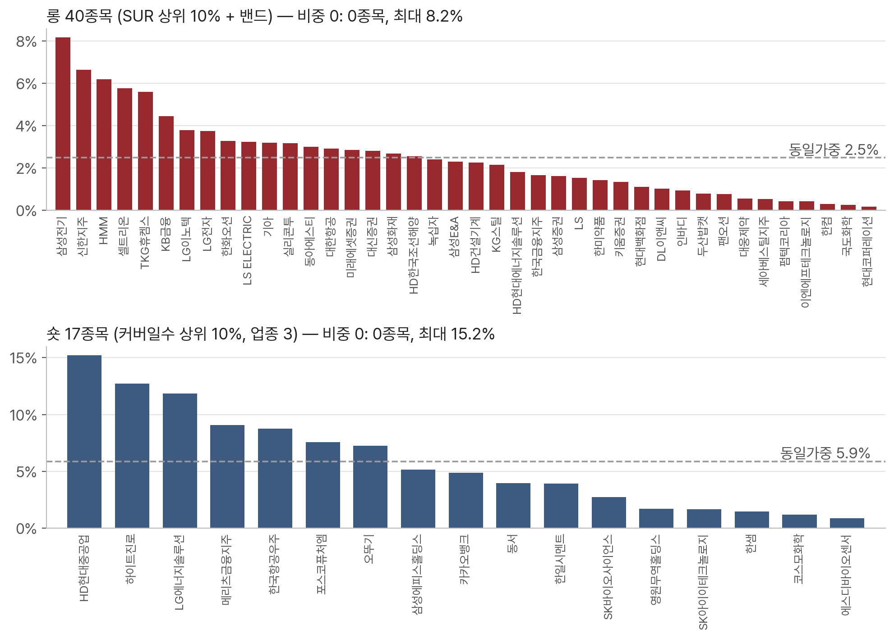

### 6-10. 문헌

| 문헌 | 내용 |
|---|---|
| Ledoit & Wolf (2004), *Journal of Multivariate Analysis* | 수축 강도를 자료에서 최적 추정하는 공식 |
| Jagannathan & Ma (2003), *Journal of Finance* | 비중 제약 = 공분산 수축. 제약 있는 최소분산이 표본 외에서 우수 |
| Engle (1982), *Econometrica* — ARCH | 변동성 군집을 처음 수식화 (2003 노벨경제학상) |
| Bollerslev (1986), *Journal of Econometrics* — GARCH | 가장 널리 쓰이는 변동성 모형 |
| J.P. Morgan (1996), *RiskMetrics Technical Document* | 지수가중 변동성 — 은행 위험관리 표준 |
| Almgren, Thum, Hauptmann & Li (2005), *Risk*; Tóth 외 (2011), *Physical Review X* | 시장 충격 ∝ √주문 규모 (v8 √거래대금 혼합의 근거) |
| Gârleanu & Pedersen (2013), *Journal of Finance* | 거래비용을 고려한 동적 매매 (비교 실험) |
| Parkinson (1980), Garman & Klass (1980), Yang & Zhang (2000) | 고가·저가 범위 기반 변동성 (비교 실험) |
| Ledoit & Wolf (2020), *Annals of Statistics* | 비선형 수축 (비교 실험) |

---

## 7. 노출과 공매도 금지 기간

| 구간 | 롱 | 숏 | gross | net |
|---|---:|---:|---:|---:|
| 숏 운용 86개월 (진입 시) | 100% | 100% | **200%** | **0%** |
| 숏 운용 86개월 (월말) | | | 평균 198.2% (161~234%) | 평균 +1.9% (−16.9% ~ +18.3%) |
| 공매도 금지 30개월 (2020-03~2021-04, 2023-11~2025-03) | 100% | 0% | 100% | 100% |

- 매월 진입 때 롱 100%, 숏 100%로 맞춘다. 월말 차이는 한 달간 롱·숏 가격 변화 때문이며 **net ±20% 이탈은 0개월**이다.
- 공매도 금지 기간은 숏 없이 롱 100%만 든다(규칙: 선물 숏 금지). v8은 롱이 대형주 쪽으로 기울어 **공매도 금지 기간 KOSPI200 베타가 0.83**이다(v7 0.45). 숏 운용 기간 베타는 0.28(v7 0.12).
- 검토했지만 채택하지 않은 노출 방식: "다리 위험 균형"(롱·숏 90~110%)은 롱 100% + 숏 100% 규칙을 어겨 채택하지 않았다.

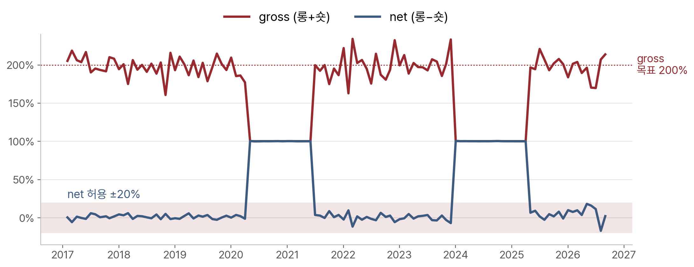

---

## 8. 성과

### 8-1. 누적

| | 전략 (비용 후) | 전략 (비용 전) | KOSPI200 |
|---|---:|---:|---:|
| 누적 | **+897%** | +1,908% | +313% |
| CAGR | **26.9%** | 36.4% | 15.8% |
| 연 변동성 | 18.7% | 18.6% | 27.5% |
| Sharpe | **1.26** | 1.66 | 0.59 |
| Sortino | 2.76 | 4.07 | 1.07 |
| MDD | **−18.9%** (2021-12 → 2023-10) | −14.2% | −33.9% |
| Calmar | 1.42 | 2.57 | 0.47 |
| 최악 / 최고의 달 | −14.9% / +21.9% | −14.2% / +22.6% | −26.1% / +33.4% |
| 월 승률 | 63.8% | 69.0% | 58.6% |

> KOSPI200은 **가격지수(배당 미포함)**다. 배당 포함 시장과의 비교는 10절(신 시장).

### 8-2. 연도별 (보유 연도 기준)

| | 2017 | 2018 | 2019 | 2020 | 2021 | 2022 | 2023 | 2024 | 2025 | 2026 (1~8월) |
|---|---:|---:|---:|---:|---:|---:|---:|---:|---:|---:|
| **v8 (비용 후)** | +8.6% | **+14.1%** | +8.9% | **+88.7%** | **+34.6%** | **−5.9%** | −0.3% | **+11.5%** | +59.5% | +74.3% |
| v8 (비용 전) | +18.2% | +23.5% | +17.9% | +98.7% | +43.9% | +2.4% | +9.0% | +16.3% | +71.5% | +83.2% |
| (참고) v7 · 체결률 미고려 | +2.9% | +30.5% | +29.6% | +52.0% | +33.5% | +2.4% | +9.3% | +12.4% | +34.6% | +29.9% |
| KOSPI200 | +25.2% | −20.8% | +12.4% | +37.7% | −1.1% | **−26.7%** | +24.4% | −11.9% | **+96.4%** | +72.3% |

- **손실 연도가 2개다(2022 −5.9%, 2023 −0.3%).** v7은 손실 연도가 없었다.
- **시장 상승기에 훨씬 잘 따라간다.** 2020년 +88.7%, 2025년 +59.5%, 2026년 +74.3%. 대형주 비중이 커진 효과다.
- **2018·2019년처럼 대형주가 약하거나 조용한 해에는 v7보다 크게 낮다**(2018 +14.1% vs +30.5%, 2019 +8.9% vs +29.6%).

### 8-3. 비용과 매매

| 항목 | 값 |
|---|---:|
| 연 회전율 | 20.7회 (v7 24.9회) |
| 연 거래비용 | 5.2% |
| 연 대차비용 | 2.2% |
| **연 총비용** | **7.4%** |
| 숏 매도대금 CD91 이자 (수익) | +1.6% |
| 손절 | 38건 (연 3.9건) |
| 숏 다리 가격 손익 (운용월 연평균) | **+7.3%** |

- 거래가 많은 종목 비중이 커져 회전율과 거래비용이 v7보다 낮다.

**비용 민감도**

| 가정 | CAGR | Sharpe | MDD |
|---|---:|---:|---:|
| 왕복 40bp | 28.2% | 1.31 | −17.1% |
| **왕복 50bp (기본)** | **26.9%** | **1.26** | **−18.9%** |
| 왕복 60bp | 25.6% | 1.20 | −20.6% |
| 50bp · 대차 연 5% | 25.0% | 1.18 | −21.8% |
| 50bp · 대차 연 8% | 22.3% | 1.05 | −25.9% |
| (참고) 50bp · 매도대금 이자 0 | — | 1.17 | — |

### 8-4. 최근 4개월

| 신호일 (보유월) | v8 | v7 | KOSPI200 |
|---|---:|---:|---:|
| 2026-04-30 (5월) | +18.7% | +3.8% | +33.4% |
| 2026-05-29 (6월) | +12.4% | +5.8% | −4.6% |
| **2026-06-30 (7월)** | **−14.9%** | −9.2% | **−26.1%** |
| 2026-07-31 (8월) | +1.8% | −0.1% | +9.0% |

### 8-5. 현재 포트폴리오 (2026-07-31 신호, 8월 보유)

**롱 비중 상위 10 (후보 40종목 모두에 비중, 유효 종목 수 25.5, 최대 8.2%)**

| 종목 | 업종 | EPS 1M 변화율 | SUR | 비중 |
|---|---|---:|---:|---:|
| 삼성전기 | 하드웨어 | 16.8% | 2.52 | 8.2% |
| 신한지주 | 은행 | 5.5% | 2.93 | 6.6% |
| HMM | 운송 | 25.3% | 2.70 | 6.2% |
| 셀트리온 | 의료 | 7.3% | 2.06 | 5.8% |
| TKG휴켐스 | 화학 | 3.8% | 1.09 | 5.6% |
| KB금융 | 은행 | 3.3% | 2.29 | 4.4% |
| LG이노텍 | 하드웨어 | 10.6% | 1.56 | 3.8% |
| LG전자 | 내구소비재및의류 | 8.7% | 2.20 | 3.7% |
| 한화오션 | 조선 | 25.2% | 3.07 | 3.3% |
| LS ELECTRIC | 기타자본재 | 6.5% | 1.84 | 3.2% |

**숏 (17종목 모두에 비중, 유효 종목 수 11.1)**

| 종목 | 업종 | 커버일수 | 비중 |
|---|---|---:|---:|
| HD현대중공업 | 조선 | 6.3일 | 15.2% |
| 하이트진로 | 음식료및담배 | 16.0일 | 12.7% |
| LG에너지솔루션 | 하드웨어 | 10.3일 | 11.9% |
| 메리츠금융지주 | 증권 | 7.2일 | 9.1% |
| 한국항공우주 | 상업서비스 | 9.6일 | 8.8% |
| 포스코퓨처엠 | 화학 | 8.2일 | 7.6% |
| 오뚜기 | 음식료및담배 | 10.3일 | 7.2% |
| 삼성에피스홀딩스 | 의료 | 11.0일 | 5.2% |
| 카카오뱅크 | 은행 | 9.2일 | 4.9% |
| 나머지 8종목 | | | 각 0.9~3.9% |

- v7과 비교하면 롱은 거래가 많은 대형주(삼성전기·KB금융·LG전자 등)가 새로 상위에 들어왔고, 숏은 음식료 비중이 23.9%로 낮아졌다.

### 8-6. 체결률 고려 여부 비교와 운용 규모

**체결률 정의:** 매달 주문(목표 포지션 − 한 달 가격 변동을 반영한 기존 보유) 중 **21일 평균 거래대금 × 10% × N일** 안에 체결할 수 있는 금액 비율. 116개월 금액 가중. 두 다리 모두 80% 이상이면 운용 가능으로 본다.

**① v7 (체결률 미고려): ADV 10% · 5일 · 롱·숏 각 1,000억 기준 약 50% 체결 → 운용 가능 규모 약 125억**

| 롱·숏 각 운용 규모 | v7 5일 (롱 / 숏) | v7 3일 (롱 / 숏) | **v8 5일 (롱 / 숏)** | v8 3일 (롱 / 숏) |
|---|---:|---:|---:|---:|
| 50억 | 89.8% / 95.9% | 84.7% / 92.3% | 97.8% / 99.4% | 96.6% / 98.8% |
| 100억 | 82.6% / 90.5% | 76.6% / 84.3% | 96.1% / 98.4% | 94.0% / 96.9% |
| **125억** | **80.0% / 87.9%** ← v7 경계 | 73.7% / 81.0% | 95.3% / 97.9% | 92.9% / 95.8% |
| 200억 | 74.3% / 81.6% | 67.2% / 73.8% | 93.1% / 96.0% | 90.1% / 92.7% |
| 500억 | 61.0% / 67.1% | 52.4% / 58.1% | 87.4% / 88.9% | 83.1% / 82.8% |
| **1,000억** | **49.4% / 54.7% (전체 50.7%)** | 40.9% / 45.4% | **81.2% / 80.2%** ← v8 경계 | 74.9% / 71.1% |
| 1,500억 | 42.6% / 47.3% | 34.7% / 38.2% | 76.3% / 73.2% | 68.6% / 62.5% |

(전체 격자는 `figures/capacity_v7_v8.csv`)


- **v7은 롱·숏 각 약 125억까지, v8은 약 1,000억까지** 두 다리 모두 체결률 80% 이상이다. 3일 기준이면 v7 약 75억, v8 약 500억이다.
- 병목은 두 버전 모두 **롱**이다. 숏 신호(커버일수 = 잔고 ÷ 회전율)도 정의상 거래가 적은 종목을 고르지만, 롱의 최소분산 쏠림이 더 크다.

**② 큰돈에서는 버전 차이가 거의 사라진다** (매도대금 이자 제외, 숏 매월 교체로 맞춘 비교)

| | 전량 체결 가정 | 1,000억 · 체결률 80% |
|---|---:|---:|
| v5 | 1.17 | 1.13 |
| v7 | 1.36 | **1.17 (= v8, 이자 제외)** |

v5 → v7에서 얻은 +0.19가 1,000억에서는 +0.04로 줄어든다(v5 값은 이전 회계 기준). 성과가 두 층에서 나오기 때문이다.

| 층 | 무엇 | 큰돈에서 |
|---|---|---|
| **신호** | SUR로 롱, 커버일수로 숏 고르기 | **남는다** → Sharpe 약 1.1~1.2 (이자 제외) |
| **비중** | 최소분산이 거래가 적은 저변동 종목에 비중을 몰아줌. 지수가중 변동성·업종 상한도 이 층을 다듬은 것 | **사라진다** |

**③ 그래도 의미가 있는 이유**

1. **알파는 진짜다.** 1,000억 제약을 걸어도 Sharpe 1.26(이자 제외 1.17)이 남는다. 신호가 유효하다는 뜻이고, KOSPI200(0.59)의 약 2배다.
2. **작게 운용하면 비중 층의 효과까지 얻는다.** 롱·숏 각 125억 이하에서는 v7 비중을 그대로 써서 Sharpe 1.48이 가능하다.
3. **1,000억에서 더 높이려면** 비중을 다듬어서는 안 되고, 거래가 많은 종목에서도 통하는 신호가 필요하다. 롱 유니버스를 거래대금 상위로 바꾸면 2017~2019년이 무너져, 단기간에 해결하기 어렵다.

**발표 문장:** "알파는 신호(SUR·커버일수)에서 나옵니다. 최소분산 비중(v7)은 이 알파를 적은 위험으로 담아 Sharpe 1.48을 내지만, 거래가 적은 종목을 선호해 1,000억에서는 주문의 50%만 체결되고 운용 가능 규모는 약 125억입니다. 그래서 1,000억 운용을 기준으로 거래대금 비중을 섞은 v8을 메인으로 삼았고, 체결률 80% 이상에서 Sharpe 1.26, 시장의 두 배입니다."

---

## 9. 위험 대비 성과 평가 (변동성 기준)

### 9-1. 같은 변동성으로 맞춘 비교

| 지표 | 전략 | 시장 (코스피+코스닥) |
|---|---:|---:|
| 연 변동성 | **18.7%** | 24.6% |
| Sharpe | **1.26** | 0.57 |
| **M²** (시장과 같은 변동성일 때 연수익) | **33.1%** | 16.2% |
| 전략을 시장 변동성으로 키운 CAGR | **34.8%** | 14.0% |
| 시장을 전략 변동성으로 줄인 CAGR | vs 26.9% | 11.7% |

### 9-2. 변동성 분해 (숏 운용 86개월)

| | 연 변동성 |
|---|---:|
| 롱 다리 | 23.6% |
| 숏 바스켓 | 20.9% |
| 롱·숏 상관 | **0.66** |
| **롱숏 전략** | **18.5%** |

롱만 들 때보다 변동성이 **약 22% 줄어든다.** 다만 롱·숏 모두 대형주 쪽으로 기울어 두 다리의 변동성이 v7(17.4% / 17.3%)보다 크다.

**같은 롱을 숏 없이 들었다면**

| | 롱온리 (같은 롱) | **롱+숏 (v8)** | KOSPI200 |
|---|---:|---:|---:|
| CAGR | 21.4% | **26.9%** | 15.8% |
| 연 변동성 | 22.7% | **18.7%** | 27.5% |
| Sharpe | 0.88 | **1.26** | 0.59 |
| MDD | −33.9% | **−18.9%** | −33.9% |
| 최악의 달 | −19.4% | **−14.9%** | −26.1% |
| KOSPI200 하락월 평균 (48개월) | −2.8% | **+0.7%** | −4.7% |
| KOSPI200 상승월 평균 | +5.1% | +3.1% | +6.0% |

### 9-3. 12개월 이동 변동성

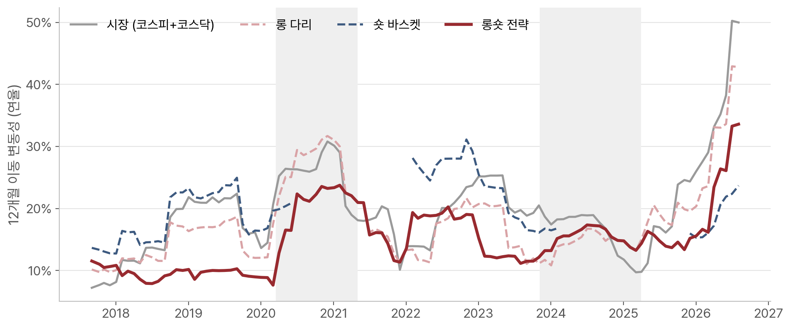

---

## 10. 요인 회귀 — 시장 포트폴리오 재정의

### 10-1. 시장 포트폴리오 (피드백 반영)

시장 요인을 KOSPI200 가격지수 대신 **코스피+코스닥 전 종목 시가총액가중·배당 포함·보유 기간 일치** 수익률로 다시 만들었다. 신 시장은 연 14.0%·변동성 24.6%, KOSPI200과 상관 0.98이다.

### 10-2. 회귀 결과 (월간, Newey-West HAC 3시차)

| 모형 | 비용 | 알파 (연) | t | MKT | SMB | HML | 조정 R² |
|---|---|---:|---:|---:|---:|---:|---:|
| CAPM · KOSPI200 | 비용 후 | 17.9% | 3.80 | 0.35 | | | 0.25 |
| **CAPM · 신 시장** | **비용 후** | **18.4%** | **3.90** | **0.36** | | | **0.22** |
| FF3 · KOSPI200 | 비용 후 | 16.8% | 3.21 | 0.35 | −0.05 | 0.13 | 0.26 |
| **FF3 · 신 시장** | **비용 후** | **16.4%** | **3.13** | **0.36** | −0.12 | 0.16 | **0.24** |
| FF3 · 신 시장 | 비용 전 | 23.8% | 4.62 | 0.36 | −0.13 | 0.16 | 0.24 |

- 알파는 연 16.4~18.4%(t 3.1~3.9)로 유의하다. 이 중 약 1.6%p는 숏 매도대금 이자다.
- **시장 베타가 0.35~0.36으로 v7(0.16~0.22)보다 크다.** 거래가 많은 대형주 쪽으로 기울고, 공매도 금지 기간(롱만 보유) 베타가 0.83이기 때문이다. 숏 운용 기간만 보면 KOSPI200 베타 0.28이다.

### 10-3. 다리별 FF3 (신 시장)

| | 알파 (연) | t | MKT | SMB | HML | 조정 R² | 개월 |
|---|---:|---:|---:|---:|---:|---:|---:|
| 전략 · 숏 운용월만 (비용 후, 이자 포함) | 11.4% | 1.97 | **0.23** | −0.26 | 0.17 | **0.21** | 85 |
| **롱 바스켓 (비용 전)** | **12.4%** | **4.05** | 0.87 | 0.18 | 0.12 | 0.81 | 115 |
| **숏 바스켓 (롱으로 봤을 때)** | **−10.5%** | **−2.18** | 0.63 | 0.41 | −0.03 | 0.54 | 85 |

- **롱·숏 모두 유의한 알파 원천이다**(롱 t 4.05, 숏 t −2.18).
- 롱 바스켓 베타(0.87)가 숏 바스켓(0.63)보다 커서 전략에 시장 베타가 남는다.

---

## 11. 검증 — 앵커 검증·민감도

### 11-1. 시작 달 운 제거

v5의 숏 2개월 교체는 시작 달에 따라 Sharpe가 1.01~1.32로 흔들렸다. v6부터 숏을 매월 교체해 이 운을 없앴다. v8에서 2개월 교체로 바꾸면 1.38(v5 시작) / 1.13(한 달 늦게), 평균 1.25로 매월(1.26)과 거의 같다.

### 11-2. 앵커 검증 — 앞 기간만 보고도 골랐을까

개선 실험의 **규칙 준수 63개 설정 + v6·v7·v8 = 66개**를 대상으로, 앞 구간 성과로 고른 설정이 뒤 구간에서 어땠는지 봤다(시작 달 두 가지 평균, 매도대금 이자 동일 적용). 63개 설정과 v6·v7은 체결률을 고려하지 않은 설정이다.

| 단계 | 학습 1위 설정 | 학습 → 표본 밖 | **v8** (학습 순위 → 표본 밖) | v7 | v5 | 중앙 |
|---|---|---:|---:|---:|---:|---:|
| ① S1(2016-12~2020-01)로 선택 → S2 | v5 + 숏 매월 | 1.79 → 1.40 (31위) | 43위 → **1.42 (27위)** | 1.57 (4위) | 1.36 | 1.38 |
| ② S1+S2(~2023-04)로 선택 → S3 | v6 | 1.56 → 1.12 (49위) | 44위 → **1.37 (32위)** | 1.31 (36위) | 1.08 | 1.34 |

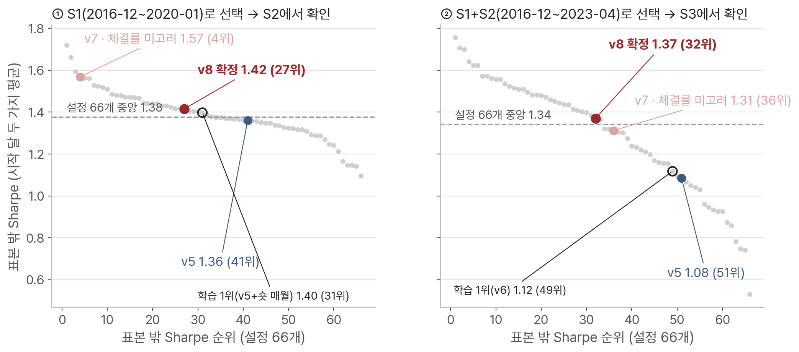

- **v8은 학습 구간에서 하위권이다.** 2017~2019년(S1) Sharpe가 1.05로 낮기 때문이다. 체결률 제약이 없는 설정들과 비교하므로 당연한 결과다.
- **표본 밖에서는 중앙 수준이다**(S2 1.42, S3 1.37). S3에서는 v7(1.31)보다 높다.
- v8은 성과가 아니라 **체결률 조건**으로 정한 설정이라, 이 검증은 "선택 편향이 없는가"보다 **"체결률을 맞춰도 표본 밖 성과가 유지되는가"**를 보여준다. 답은 "유지된다(1.37~1.42)"이다.

### 11-3. SUR 신호의 구간별 유의성

SUR Fama-MacBeth 계수 t: 2012-08~2016-11 3.16, 2016-12~2026-07 5.13 (3-8절). 5분위 Q5−Q1은 +15.4%p(t 3.38), +12.8%p(t 4.58). 설정을 뒤 구간에서 골랐으므로 표본 밖 검증이 아니라 두 구간 모두 유의하다는 확인이다. 신호 IC는 창 6~24개월 모두 0.030~0.031.

### 11-4. 설정값 민감도 (v8에서 한 가지만 바꿨을 때의 Sharpe)

| 손잡이 | 값 → Sharpe | 판단 |
|---|---|---|
| **√거래대금 혼합 (롱)** | 0.45 1.34 · 0.55 1.30 · **0.65 1.26** · 0.75 1.21 · 0.85 1.17 | 체결률과 맞바꿈 (6-8) |
| **√거래대금 혼합 (숏)** | 0.5 1.26 · 0.6 1.26 · **0.7 1.26** · 0.8 1.24 · 0.9 1.23 | 평평 |
| 변동성 반감기 | 10일 1.24 · **20일 1.26** · 40일 1.25 · 60일 1.24 | 평평 |
| 숏 교체 | **매월 1.26** · 2개월 1.38 (한 달 늦으면 1.13, 평균 1.25) · 3개월 1.27 | 2개월 평균 ≈ 매월 |
| 손절 | 없음 1.25 · 20% 1.25 · **30% 1.26** · 40% 1.23 | 평평 |
| 롱 업종 비중 상한 | 없음 1.25 · 20% 1.27 · 25% 1.27 · **30% 1.26** · 35% 1.25 · 40% 1.25 | 평평 (혼합으로 거의 안 걸림) |
| 숏 업종 비중 상한 | 없음 1.26 · 20% 1.26 · 25% 1.26 · **30% 1.26** · 35% 1.26 · 40% 1.26 | 평평 |
| 숏 업종 종목 수 상한 | 2 1.36 · **3 1.26** · 4 1.17 · 없음 1.16 | 2가 더 높음 (13절) |
| 롱 비율 | 8% 1.26 · **10% 1.26** · 12% 1.17 | |
| 숏 비율 | 8% 1.21 · **10% 1.26** · 12% 1.28 · 15% 1.24 | 평평 |
| 롱 밴드 | 1.5배 1.17 · **2배 1.26** · 2.5배 1.21 | |
| 숏 밴드 | 1.5배 1.23 · **2배 1.26** · 3배 1.26 | 평평 |
| SUR 창 | **12개월 1.26** · 18개월 1.17 · 24개월 1.10 · 원 리비전 1.06 | v7보다 완만 |

- v8은 v7보다 **대부분의 손잡이에서 평평하다.** 비중이 고르게 퍼져 개별 설정의 영향이 줄었다.

---

## 12. 설정값별 "왜 이 값인가" 답변

**공통:** "종목 선정 설정은 **앵커 3구간 워크포워드**로 두 번 연속 선택된 값이고, v6·v7 변경(지수가중 변동성·숏 매월·업종 30%)은 시작 달 운을 없애고 쏠림을 막는 규칙, v8의 혼합 비율은 **Sharpe가 아니라 체결률 80% 조건으로 정한 값**입니다."

| 설정 | 답변 요지 | 근거 절 |
|---|---|---|
| **√거래대금 혼합 롱 0.65 · 숏 0.7** | 롱·숏 각 1,000억에서 그 다리의 매매 체결률이 80%를 넘는 가장 작은 값. √는 시장 충격 ∝ √주문 규모 | 6-8 |
| **체결률 기준 (거래대금 10% × 5일, 1,000억)** | 하루 거래대금의 10% 이상을 쓰면 시장 충격이 커진다는 실무 관례, 월간 교체라 5일 안에 집행 | 8-6 |
| **롱·숏 상위 10%** | 팩터 연구의 10분위 관행. 롱·숏 같은 원칙. 앵커 검증이 두 번 선택 | 5, 11-2 |
| **밴드 2배** | 교체 이득 < 비용이라 밴드 필요. 2배는 관례값 | 5-3 |
| **최소분산 (혼합의 한쪽)** | 수축 강도를 공식이 자료에서 계산. 같은 후보 동일가중(1.07)보다 1.26으로 높다 | 6, 6-9 |
| **지수가중 변동성, 반감 20일** | 변동성 군집(ARCH/GARCH), RiskMetrics. 반감 10~60일 모두 1.24~1.26 | 6-6 |
| **숏 매월 교체** | 2개월은 시작 달 운(1.13~1.38). 매월은 운 없이 1.26 ≈ 2개월 평균 1.25 | 4-4 |
| **롱 100% · 숏 100%** | 규칙 (gross 200%, 달러 중립) | 7 |
| **SUR 창 12개월** | FY1 전망이 한 바퀴 도는 주기, SUE 문헌(8분기)과 비슷한 관측 수 | 3-5 |
| **SUR 최소 8개월** | 12개월의 약 3분의 2, 튜닝하지 않은 관례값 | 3-5 |
| **숏 업종 상한 3종목** | 업종 동반 반등(스퀴즈) 방지. v5 앵커 검증으로 정한 값 | 4-5 |
| **롱·숏 업종 비중 30%** | 숏 손절선 +30%와 짝(30% × 30% = NAV 9%). 롱도 같은 값. v8에서는 거의 걸리지 않음 | 4-5, 6-7 |
| **손절 +30%** | 가격제한폭 기준점. 수준을 바꿔도 결과 같음 | 4-6 |
| **숏 유니버스 KOSPI200** | 대차 공급·규제 측면에서 실행 가능. 커버일수 효과가 대형주에서 뚜렷 | 4-3 |
| **공매도 금지 기간 롱온리** | 선물 숏 금지 규칙 | 7 |
| **비용 50bp·대차 3%** | 보수적 가정. 60bp에서 1.20, 대차 8%에서 1.05 | 8-3 |
| **숏 매도대금 CD91 이자** | 담보로 둔 매도대금이 단기 금리를 받는 표준 가정. 받지 못하면 1.17 | 2-4 |

---

## 13. 솔직하게 말해야 할 것

1. **체결률을 맞추면서 성과를 크게 내줬다.** v7(체결률 미고려) 1.48 → v8 1.26. 변동성 13.6% → 18.7%, MDD −11.0% → −18.9%. v7의 좋은 성과는 상당 부분 거래가 적은 저변동 종목에서 나왔다(8-6).
2. **손실 연도가 2개다.** 2022년 −5.9%(시장 −26.7%), 2023년 −0.3%. MDD도 2021-12부터 2023-10까지 길게 이어졌다.
3. **시장 베타가 커졌다.** 전체 0.36, 숏 운용 기간 0.28, 공매도 금지 기간 0.83. 대형주 쪽으로 기울면서 시장이 오를 때는 잘 따라가고(2025년 +59%), 내릴 때는 더 아프다(2026년 7월 −14.9%).
4. **2017~2019년(S1)이 약하다(1.05).** 운용 규모를 1,000억으로 고정해, 시장 거래대금이 작던 초기에 체결률 제약이 더 강하게 걸렸다. 앵커 검증에서도 학습 구간 하위권이었다.
5. **혼합 비율(0.65·0.7)은 전 기간 체결률로 정했다.** 체결률은 미래 수익을 보지 않지만, 매달 다시 정하는 동적 방식은 이전(v5) 검토에서 고정보다 나빴다.
6. **숏 업종 종목 수 상한 2가 더 높다(1.36 vs 1.26).** 상한 3은 v5에서 앵커 검증으로 정한 값이라, v8 결과를 보고 바꾸지 않았다.
7. **숏 매도대금 이자를 가정했다**(연 +1.6%). 받지 못하면 Sharpe 1.17.
8. **비용이 크다.** 연 7.4%(거래 5.2% + 대차 2.2%). 비용 전 Sharpe 1.66이 비용 후 1.26으로 내려온다.
9. **KOSPI200 비교는 가격지수(배당 미포함)**라 벤치마크가 연 1.5~2%p 불리하다. 배당 포함 비교는 10절.
10. **어느 설정에서도 유지되는 것:** SUR이 원 리비전보다 낫고(1.26 vs 1.06), 롱·숏 모두 유의한 알파가 있으며(롱 t 4.05, 숏 t −2.18), 롱숏이 롱온리보다 낫다(1.26 vs 0.88).

---

## 14. 부록 A. 설계 변경 이력 (v1 → v8)

| 항목 | v1 (09-18) | v2 (09-23) | v5 (09-24) | v6 (09-28) | v7 (09-28) | **v8 (09-29, 최종)** |
|---|---|---|---|---|---|---|
| 롱 신호 | EPS 1개월 변화율 | **SUR 12개월** | SUR 12개월 | SUR 12개월 | SUR 12개월 | SUR 12개월 |
| 롱 종목 / 밴드 | 30 / 2배 | 40 / 2.5배 | **상위 10% / 2배** | 상위 10% / 2배 | 상위 10% / 2배 | 상위 10% / 2배 |
| 숏 종목 · 교체 | 30 · 매월 | **상위 10% · 2개월** | 상위 10% · 2개월 | 상위 10% · **매월** | 상위 10% · 매월 | 상위 10% · 매월 |
| 업종 상한 | 숏 5종목 | 숏 3종목 | 숏 3종목 | 숏 3종목 + **숏 비중 30%** | + **롱 비중 30%** | 같음 |
| 비중 | 동일가중 + ADV 한도 + 4% 상한 | 동일가중 | **LW 최소분산** | LW 상관 × **지수가중 변동성** | 같음 | **0.35(롱)·0.3(숏) × 최소분산 + √거래대금** |
| 숏 매도대금 이자 | 0 | 0 | 0 | 0 | **CD91** | CD91 |
| 체결 | 다음 거래일 시가 | **다음 거래일 종가** | 종가 | 종가 | 종가 | 종가 |
| 1,000억 체결률 (5일) | — | — | 58% / 60% | 49% / 55% | 49% / 55% | **81% / 80%** |
| **Sharpe / CAGR / MDD** | 1.04 / 19.8% / −23.9% | 1.13 / 23.0% / −19.1% | 1.32 / 21.3% / −12.2% (시작 달 평균 1.17) | 1.29 / 20.6% / −11.7% | 1.48 / 23.6% / −11.0% (이자 제외 1.36) | **1.26 / 26.9% / −18.9%** (이자 제외 1.17) |

---

## 15. 부록 B. 검토했지만 채택하지 않은 기법

예상 질문 대비용. 모두 워크포워드(예측 시점에 확정된 과거 자료로만 학습) 또는 IS(2012-08~2016-11) 선택 후 본 기간에서 평가했다. **Sharpe는 시험 당시의 기준 엔진(v2 동일가중 1.13, v5 1.32) 기준**이고, 개선 실험(09-27)은 시작 달 두 가지 평균(v5 1.17)이다.

| 분류 | 기법 | 근거 문헌 | 결과 (Sharpe) | 탈락 이유 |
|---|---|---|---:|---|
| 롱 신호 | 복합 SUR (EPS + 영업이익 FQ1) | Fairfield 외 (1996) | 평균 1.00 | 신호는 강했지만(t 5.48) 포트폴리오에선 한 조합만 좋음 |
| | 잔차 리비전 (업종·규모·베타·모멘텀) | Novy-Marx (2015) | 0.64~1.00 | 가격이 확인한 리비전까지 제거 |
| | 베이즈 수축, 칼만 필터 | James-Stein, 상태공간 | 0.78~0.87 | 극단 리비전을 평균으로 당기거나 식은 신호를 섞음 |
| | 동종업계 파급, 네트워크 모멘텀 | Hou (2007), Pu 외 (2023) | 1.01~1.05 | IS에서 좋았다가 OOS에서 악화 |
| | 밸류 결합, 리비전 기간구조, 배당 SUR, 수급 역발상, 정보 불확실성 | Asness 외 (2013), Da & Warachka (2009), Zhang (2006) | 0.66~0.96 | IS 국면(2012~16 소형주 강세)과 OOS 국면(대형주 강세)이 다름 |
| | 매수압력 (CMF·Williams BP 등) | | < 0.3 | 2017년 이후 무의미 |
| ML | 메타라벨링 (로지스틱·LightGBM·XGBoost) | López de Prado (2018) | 0.71~1.13 | SUR 후보 안에서 추가로 가려낼 정보 없음 (IC ≈ 0) |
| | 메타라벨링 v2 (앙상블·확률 보정·베팅 크기) | Meyer 외 (2023), Thumm 외 (2023) | 0.49~1.12 | 적중 확률이 대부분 0.5 미만. 수익이 오른쪽 꼬리에서 나옴 |
| | LightGBM 순위 학습, IPCA | 한국 ML 연구 (2023), Kelly 외 (2019) | 0.38~0.81 | |
| 숏 신호 | 커버일수 평활·표준화·대차 활용도·1주성분·스퀴즈 회피 등 | | 평균 0.89~1.01 | 규모·베타 잔차가 평균 1.01로 비슷, 나머지 악화 |
| 노출 | 변동성 타깃, 변화점 탐지(BOCPD), 팩터 모멘텀 | Wood 외 (2022), Ehsani & Linnainmaa (2022) | — | 폭락 한 달을 막는 대신 반등장을 더 크게 놓침 / IS 탈락 |
| 비중 | HRP, 위험균등(ERC), 변동성 역가중, 비중 상한 | López de Prado (2016) | 1.11~1.25 | 최소분산보다 효과가 작거나 상한값이 임의적 |
| 배리어 | 롱 손절·익절 | 삼중 배리어 | 0.97~1.14 | 효과 없음 |
| 롱 신호 (2026-09-26 추가, v5 엔진) | 끈적한 기대: SUR ÷ (1 − 종목별 리비전 자기상관) | Bouchaud 외 (2019, JF) | 1.32 | 자기상관 평균 0.11로 작아 SUR과 순위가 거의 같음 (증분 t 0.83) |
| | 시그니처 레비 면적 (리비전 경로가 주가 경로를 앞서는지) | Bennett 외 (2022), Futter 외 (2023) | 0.95 | 신호 없음 (IS t 0.33). 월별 12개 점으로는 선후 관계를 못 잼 |
| | 리비전 가속도 | He & Narayanamoorthy (2020, JAE) | 1.15 | SUR 통제 시 증분 없음 |
| ML | 랜덤 푸리에 특징 2,000개 릿지 (복잡성의 미덕) | Kelly, Malamud & Zhou (2024, JF) | 1.11 → 보완판 1.17~1.22 | 횡단면 증분은 유의(t 3.3)하나 상위 10% 선별에는 도움 안 됨. SUR 상위 후보군 안에서 학습·2단계 선별로 보완해도 롱 다리는 SUR과 같은 수준(차이 t −0.1~−1.2) |
| 롱 신호 분모 | 주가 변동성(종가 60·252일)으로 SUR 분모 교체. Parkinson(고가·저가)은 자료 없어 불가 | Parkinson (1980) | 1.03~1.05 | 분모는 전망 자체의 흔들림이어야 함 |

**이 부록이 보여주는 것:** IS에서 좋았던 기법 대부분이 본 기간에서 무너졌고, **SUR 신호·커버일수·최소분산 비중만 살아남았다.** 전략의 핵심이 사후 선택이 아니라는 근거다.

---
| 개선 실험 (09-27) | 공분산 변동성: Parkinson·Garman-Klass·Yang-Zhang (20~252일) | Parkinson (1980) 외 | 1.09~1.27 (시작 달 평균) | 효과 있음. 단순한 종가 지수가중과 비슷해 종가 지수가중 채택 |
| | 공분산 상관: 비선형 수축 NLS, PCA 1·3·5팩터, 상관 LW, 상관 창 126·504일 | Ledoit & Wolf (2020) | 1.02~1.29 | 상관 추정 방식은 거의 무관 |
| 노출 (09-28) | 다리 위험 균형: 직전 달 롱·숏 예상 변동성으로 롱·숏을 90~110% 조정 (gross 200%, net ±20%) | Maillard, Roncalli & Teïletche (2010) | 1.38 | **규칙(롱 100% + 숏 100%) 위반으로 미채택** |
| | 비중: 정식 QP, 최대 분산화, 신호 평균-분산, 최소분산+신호 반반 | Choueifaty & Coignard (2008) | 0.75~1.03 | 악화 |
| | 롱: 시총·회전율 3구간 중립 SUR, SUR − 커버일수, 롤링 FM 2단계 | | 0.98~1.19 | 개선 없음 |
| | 숏: 커버일수 + 하향 리비전, KOSPI200 시총 상위 100만 | | 0.69~0.87 | 악화 |

---

## 16. 산출물·재현

제출 폴더 구조와 실행 방법은 저장소 최상위 `README.md`에 있다.

| 이 문서의 내용 | 재현 위치 |
|---|---|
| 0-1 성과, 8-1·8-2 누적·연도별, 8-3 비용, 8-5 현재 포트폴리오 | `notebooks/v8_backtest.ipynb` 5~8·11·13절 → `output/performance.csv`, `yearly.csv`, `nav.csv`, `costs.csv`, `holdings_*_last.csv` |
| 0-2·8-6 체결률 고려 여부 비교 (v8 vs v7), 운용 규모 | 노트북 12절 → `output/fill_rate.csv`, `v8_vs_v7.csv` |
| 4-6 손절 38건 | 노트북 11절 → `output/stop_events.csv` |
| 10 요인 회귀 (KOSPI200 · 코스피+코스닥 시총가중) | 노트북 10절 → `output/factor_regression.csv` |
| 3-8·4-3 신호 검증 (SUR·원 리비전·커버일수 5분위, 시가총액 교차 히트맵 3×3·4×4·5×5) | 노트북 4-2절 → `output/quintiles.csv`, `heatmap_sur_x_size_*.csv`, `heatmap_dtc_x_size_*.csv`, `fig_quintiles.png`, `fig_heatmaps_*.png` |
| 9 위험 대비 성과 (M², 변동성 분해, 롱온리 비교, 12개월 이동 변동성) | 노트북 14절 → `output/vol_eval.csv`, `long_only_compare.csv`, `fig_rolling_vol.png` |
| 11-4 설정값 민감도, 6-8 혼합 비율 민감도 | 노트북 15절 → `output/sensitivity.csv`, `blend_sensitivity.csv` |
| 11-2 앵커 검증 (66개 설정) | 노트북 16절 → `output/anchored_validation.csv`, `fig_anchored_validation.png` |
| 구간별 Sharpe (S1·S2·S3) | 노트북 9절 |

- 노트북은 이 문서의 v8 수치, v7(혼합 비율 0) 비교, 신호 검증, 민감도, 앵커 검증을 재현한다. 앵커 검증의 다른 설정 63개는 고가·저가 공분산 등 이 엔진에 없는 방식이라 연구 단계의 월별 수익률(`code/research_results/anchored_configs_monthly_ret.csv`, 포지션 회계 수정 전)을 읽어 쓰고, v6·v7·v8은 엔진으로 계산한다.
- 노트북에 없는 것: 3-8 Fama-MacBeth IS·OOS, 3-9 z-score 비교, 10-3 다리별 FF3, 4-4·6-6·6-7의 이전 버전 비교표, 6-8 "다른 방법과 비교", 부록 B. 연구 과정에서 따로 돌린 결과이며 표만 싣는다.
- 엔진은 연구용 코드를 한 파일로 정리한 것이고, 월별 수익률 116개월이 연구용 결과와 소수점 16자리까지 같음을 확인했다 (2026-09-30 포지션 회계 수정 후 두 엔진 모두 다시 확인).
